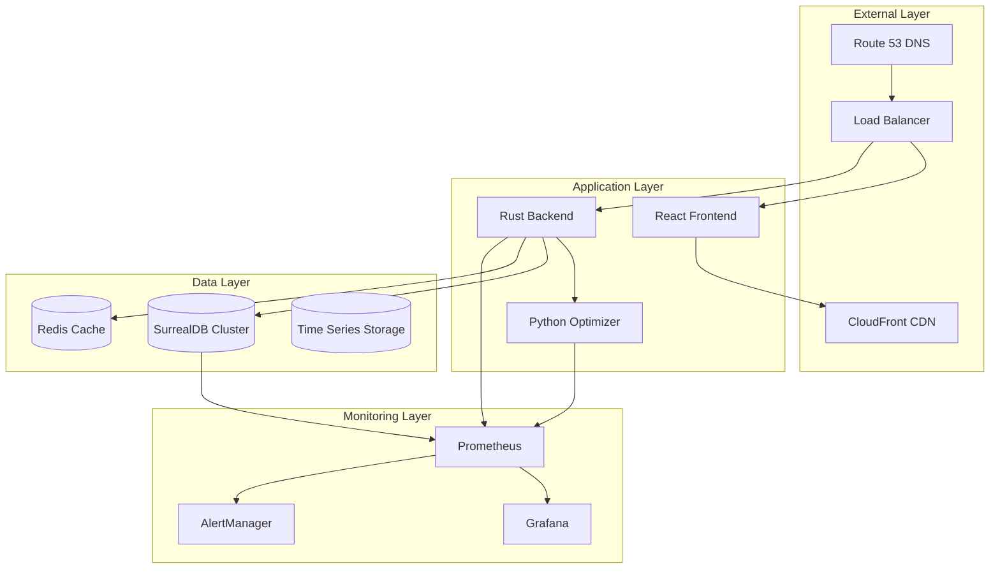

# 🚀 Railway Intelligence System - Deployment & Infrastructure Guide

## 📋 Document Overview

This comprehensive guide covers deployment strategies, infrastructure requirements, containerization, orchestration, monitoring, and scaling for the Railway Intelligence System. It provides step-by-step instructions for development, staging, and production deployments.

**Deployment Status**: Development Ready → Production Planning  
**Infrastructure**: Cloud-Native, Container-First Architecture  
**Scaling Strategy**: Horizontal Microservices Scaling  

---

## 🎯 Infrastructure Architecture Overview

### 1. **High-Level Architecture**



### 2. **Deployment Environments**

```
Environment Hierarchy:
├── Development (Local)
│   ├── Docker Compose
│   ├── Local databases
│   ├── Hot reload enabled
│   └── Debug logging
├── Staging (Cloud)
│   ├── Kubernetes cluster
│   ├── Managed databases
│   ├── Production-like configs
│   └── Integration testing
└── Production (Cloud)
    ├── Multi-zone deployment
    ├── High availability setup
    ├── Performance optimized
    └── Security hardened
```

---

## 🐳 Containerization Strategy

### 1. **Docker Configurations**

#### Rust Backend Dockerfile

**File: `backend/Dockerfile`**

```dockerfile
# Multi-stage build for optimal image size
FROM rust:1.75-slim as builder

# Install system dependencies
RUN apt-get update && apt-get install -y \
    pkg-config \
    libssl-dev \
    protobuf-compiler \
    && rm -rf /var/lib/apt/lists/*

# Create app directory
WORKDIR /app

# Copy dependency files first (for better caching)
COPY Cargo.toml Cargo.lock ./
COPY proto/ ./proto/
COPY build.rs ./

# Create dummy main.rs for dependency compilation
RUN mkdir src && echo "fn main() {}" > src/main.rs

# Build dependencies (cached layer)
RUN cargo build --release && rm -rf src/

# Copy source code
COPY src/ ./src/

# Build application
RUN cargo build --release

# Runtime stage
FROM debian:bookworm-slim

# Install runtime dependencies
RUN apt-get update && apt-get install -y \
    ca-certificates \
    libssl3 \
    && rm -rf /var/lib/apt/lists/*

# Create non-root user
RUN useradd -m -u 1001 railway

# Copy binary from builder stage
COPY --from=builder /app/target/release/railway-backend /usr/local/bin/

# Copy configuration files
COPY config/ /app/config/

# Set ownership
RUN chown -R railway:railway /app

# Switch to non-root user
USER railway

# Expose port
EXPOSE 8000

# Health check
HEALTHCHECK --interval=30s --timeout=10s --start-period=5s --retries=3 \
    CMD curl -f http://localhost:8000/health || exit 1

# Set entrypoint
ENTRYPOINT ["railway-backend"]
```

#### Python Optimizer Dockerfile

**File: `optimizer/Dockerfile`**

```dockerfile
FROM python:3.11-slim

# Install system dependencies
RUN apt-get update && apt-get install -y \
    gcc \
    g++ \
    && rm -rf /var/lib/apt/lists/*

# Set working directory
WORKDIR /app

# Copy requirements first (for better caching)
COPY requirements.txt .

# Install Python dependencies
RUN pip install --no-cache-dir -r requirements.txt

# Copy source code
COPY src/ ./src/
COPY proto/ ./proto/

# Generate gRPC code
RUN python -m grpc_tools.protoc \
    -I./proto \
    --python_out=./src \
    --grpc_python_out=./src \
    proto/optimization.proto

# Create non-root user
RUN useradd -m -u 1001 optimizer && chown -R optimizer:optimizer /app
USER optimizer

# Expose gRPC port
EXPOSE 50051

# Health check
HEALTHCHECK --interval=30s --timeout=10s --start-period=10s --retries=3 \
    CMD python -c "import grpc; channel = grpc.insecure_channel('localhost:50051'); channel.close()" || exit 1

# Set Python path
ENV PYTHONPATH=/app/src

# Start gRPC server
CMD ["python", "src/grpc_server.py"]
```

#### React Frontend Dockerfile

**File: `frontend/Dockerfile`**

```dockerfile
# Build stage
FROM node:18-alpine as builder

WORKDIR /app

# Copy package files
COPY package*.json ./

# Install dependencies
RUN npm ci --only=production

# Copy source code
COPY src/ ./src/
COPY public/ ./public/
COPY tsconfig.json ./

# Build application
RUN npm run build

# Production stage
FROM nginx:alpine

# Copy built application
COPY --from=builder /app/build /usr/share/nginx/html

# Copy nginx configuration
COPY nginx.conf /etc/nginx/nginx.conf

# Create non-root user
RUN addgroup -g 1001 -S railway && adduser -S railway -u 1001 -G railway

# Set ownership
RUN chown -R railway:railway /usr/share/nginx/html

# Expose port
EXPOSE 3000

# Health check
HEALTHCHECK --interval=30s --timeout=3s --start-period=5s --retries=3 \
    CMD wget --no-verbose --tries=1 --spider http://localhost:3000/ || exit 1

# Start nginx
CMD ["nginx", "-g", "daemon off;"]
```

#### SurrealDB Configuration

**File: `database/Dockerfile`**

```dockerfile
FROM surrealdb/surrealdb:latest

# Copy initialization scripts
COPY init/ /docker-entrypoint-initdb.d/
COPY schema.sql /app/schema.sql

# Set ownership
RUN chown -R surrealdb:surrealdb /app

# Expose ports
EXPOSE 8000

# Health check
HEALTHCHECK --interval=30s --timeout=10s --start-period=30s --retries=3 \
    CMD surreal isready --conn http://localhost:8000 || exit 1

# Default command
CMD ["start", "--log", "info", "--user", "root", "--pass", "root", "file:///data/railway.db"]
```

### 2. **Docker Compose Configurations**

#### Development Environment

**File: `docker-compose.dev.yml`**

```yaml
version: '3.8'

services:
  # Database for development
  surrealdb-dev:
    build:
      context: ./database
      dockerfile: Dockerfile
    container_name: railway-surrealdb-dev
    ports:
      - "8001:8000"
    environment:
      - SURREAL_USER=root
      - SURREAL_PASS=root
      - SURREAL_LOG=trace
    volumes:
      - dev_db_data:/data
      - ./database/init:/docker-entrypoint-initdb.d
    networks:
      - railway-dev
    restart: unless-stopped

  # Rust backend for development
  railway-backend-dev:
    build:
      context: ./backend
      dockerfile: Dockerfile.dev  # Development-specific dockerfile
    container_name: railway-backend-dev
    ports:
      - "8000:8000"
      - "9090:9090"  # Metrics port
    environment:
      - DATABASE_URL=ws://surrealdb-dev:8000
      - RUST_LOG=debug
      - OPTIMIZATION_GRPC_URL=http://railway-optimizer-dev:50051
      - ENVIRONMENT=development
    depends_on:
      - surrealdb-dev
      - railway-optimizer-dev
    volumes:
      - ./backend/src:/app/src:ro  # Mount source for hot reload
      - ./logs/backend:/app/logs
    networks:
      - railway-dev
    restart: unless-stopped

  # Python optimizer for development
  railway-optimizer-dev:
    build:
      context: ./optimizer
      dockerfile: Dockerfile.dev
    container_name: railway-optimizer-dev
    ports:
      - "50051:50051"
    environment:
      - PYTHONPATH=/app/src
      - LOG_LEVEL=DEBUG
      - ENVIRONMENT=development
    volumes:
      - ./optimizer/src:/app/src:ro  # Mount source for hot reload
      - ./logs/optimizer:/app/logs
    networks:
      - railway-dev
    restart: unless-stopped

  # React frontend for development
  railway-frontend-dev:
    build:
      context: ./frontend
      dockerfile: Dockerfile.dev
    container_name: railway-frontend-dev
    ports:
      - "3000:3000"
    environment:
      - REACT_APP_API_URL=http://localhost:8000
      - REACT_APP_WS_URL=ws://localhost:8000/ws
      - CHOKIDAR_USEPOLLING=true  # Hot reload on Windows
    volumes:
      - ./frontend/src:/app/src:ro
      - ./frontend/public:/app/public:ro
    depends_on:
      - railway-backend-dev
    networks:
      - railway-dev
    restart: unless-stopped

  # Redis for caching
  redis-dev:
    image: redis:7-alpine
    container_name: railway-redis-dev
    ports:
      - "6379:6379"
    volumes:
      - redis_dev_data:/data
    networks:
      - railway-dev
    restart: unless-stopped

volumes:
  dev_db_data:
  redis_dev_data:

networks:
  railway-dev:
    driver: bridge
```

#### Production Environment

**File: `docker-compose.prod.yml`**

```yaml
version: '3.8'

services:
  # Production SurrealDB cluster
  surrealdb-primary:
    build:
      context: ./database
      dockerfile: Dockerfile
    container_name: railway-surrealdb-primary
    environment:
      - SURREAL_USER=root
      - SURREAL_PASS=${DB_PASSWORD}
      - SURREAL_LOG=info
    volumes:
      - prod_db_primary:/data
      - ./database/backups:/backups
    networks:
      - railway-prod
    restart: always
    deploy:
      resources:
        limits:
          cpus: '2.0'
          memory: 4G
        reservations:
          cpus: '1.0'
          memory: 2G

  surrealdb-replica:
    build:
      context: ./database
      dockerfile: Dockerfile
    environment:
      - SURREAL_USER=root
      - SURREAL_PASS=${DB_PASSWORD}
      - SURREAL_LOG=info
      - REPLICA_MODE=true
    volumes:
      - prod_db_replica:/data
    networks:
      - railway-prod
    restart: always
    deploy:
      replicas: 2
      resources:
        limits:
          cpus: '1.5'
          memory: 3G

  # Production backend with multiple replicas
  railway-backend:
    build:
      context: ./backend
      dockerfile: Dockerfile
    environment:
      - DATABASE_URL=ws://surrealdb-primary:8000
      - RUST_LOG=info
      - OPTIMIZATION_GRPC_URL=http://railway-optimizer:50051
      - REDIS_URL=redis://redis-cluster:6379
      - ENVIRONMENT=production
      - JWT_SECRET=${JWT_SECRET}
    depends_on:
      - surrealdb-primary
      - railway-optimizer
      - redis-cluster
    networks:
      - railway-prod
    restart: always
    deploy:
      replicas: 3
      resources:
        limits:
          cpus: '1.0'
          memory: 512M
        reservations:
          cpus: '0.5'
          memory: 256M
      update_config:
        parallelism: 1
        delay: 10s
        failure_action: rollback

  # Production optimizer cluster
  railway-optimizer:
    build:
      context: ./optimizer
      dockerfile: Dockerfile
    environment:
      - PYTHONPATH=/app/src
      - LOG_LEVEL=INFO
      - ENVIRONMENT=production
      - GRPC_MAX_WORKERS=20
    networks:
      - railway-prod
    restart: always
    deploy:
      replicas: 2
      resources:
        limits:
          cpus: '2.0'
          memory: 1G
        reservations:
          cpus: '1.0'
          memory: 512M

  # Production frontend
  railway-frontend:
    build:
      context: ./frontend
      dockerfile: Dockerfile
    environment:
      - REACT_APP_API_URL=https://api.railway-intelligence.gov.in
      - REACT_APP_WS_URL=wss://api.railway-intelligence.gov.in/ws
    networks:
      - railway-prod
    restart: always
    deploy:
      replicas: 2
      resources:
        limits:
          cpus: '0.5'
          memory: 256M

  # Redis cluster for caching
  redis-cluster:
    image: redis:7-alpine
    command: redis-server --appendonly yes --cluster-enabled yes
    volumes:
      - redis_prod_data:/data
    networks:
      - railway-prod
    restart: always
    deploy:
      replicas: 3
      resources:
        limits:
          cpus: '0.5'
          memory: 512M

  # Load balancer
  nginx-lb:
    image: nginx:alpine
    ports:
      - "80:80"
      - "443:443"
    volumes:
      - ./nginx/nginx.conf:/etc/nginx/nginx.conf
      - ./nginx/ssl:/etc/nginx/ssl
    depends_on:
      - railway-backend
      - railway-frontend
    networks:
      - railway-prod
    restart: always

volumes:
  prod_db_primary:
  prod_db_replica:
  redis_prod_data:

networks:
  railway-prod:
    driver: overlay
    attachable: true

secrets:
  db_password:
    external: true
  jwt_secret:
    external: true
```

---

## ☸️ Kubernetes Deployment

### 1. **Namespace and Configuration**

#### Namespace Definition

**File: `k8s/base/namespace.yaml`**

```yaml
apiVersion: v1
kind: Namespace
metadata:
  name: railway-intelligence
  labels:
    name: railway-intelligence
    environment: production
---
apiVersion: v1
kind: ResourceQuota
metadata:
  name: railway-quota
  namespace: railway-intelligence
spec:
  hard:
    requests.cpu: "8"
    requests.memory: 16Gi
    limits.cpu: "16"
    limits.memory: 32Gi
    persistentvolumeclaims: "10"
    services: "10"
    secrets: "10"
    configmaps: "10"
```

#### ConfigMap for Application Configuration

**File: `k8s/base/configmap.yaml`**

```yaml
apiVersion: v1
kind: ConfigMap
metadata:
  name: railway-config
  namespace: railway-intelligence
data:
  # Application configuration
  RUST_LOG: "info"
  LOG_LEVEL: "INFO"
  ENVIRONMENT: "production"
  
  # Service URLs
  DATABASE_URL: "ws://surrealdb-service:8000"
  OPTIMIZATION_GRPC_URL: "http://optimizer-service:50051"
  REDIS_URL: "redis://redis-service:6379"
  
  # Performance tuning
  MAX_CONNECTIONS: "1000"
  CONNECTION_TIMEOUT: "30"
  OPTIMIZATION_TIMEOUT: "5"
  
  # Feature flags
  FEATURE_ML_PREDICTION: "false"
  FEATURE_ADVANCED_ANALYTICS: "true"
  FEATURE_SIMULATION: "true"
---
apiVersion: v1
kind: Secret
metadata:
  name: railway-secrets
  namespace: railway-intelligence
type: Opaque
data:
  # Base64 encoded secrets (replace with actual values)
  JWT_SECRET: Zm9vYmFyYmF6  # foobarabaz
  DB_PASSWORD: cGFzc3dvcmQxMjM=  # password123
  API_KEY: YWJjZGVmZ2hpams=  # abcdefghijk
```

### 2. **Database Deployment**

#### SurrealDB StatefulSet

**File: `k8s/base/surrealdb-statefulset.yaml`**

```yaml
apiVersion: apps/v1
kind: StatefulSet
metadata:
  name: surrealdb
  namespace: railway-intelligence
spec:
  serviceName: surrealdb
  replicas: 3
  selector:
    matchLabels:
      app: surrealdb
  template:
    metadata:
      labels:
        app: surrealdb
    spec:
      containers:
      - name: surrealdb
        image: surrealdb/surrealdb:latest
        command:
          - surreal
          - start
          - --log
          - info
          - --user
          - root
          - --pass
          - $(DB_PASSWORD)
          - file:///data/railway.db
        ports:
        - containerPort: 8000
          name: http
        env:
        - name: DB_PASSWORD
          valueFrom:
            secretKeyRef:
              name: railway-secrets
              key: DB_PASSWORD
        volumeMounts:
        - name: data
          mountPath: /data
        - name: config
          mountPath: /config
        resources:
          requests:
            cpu: 500m
            memory: 1Gi
          limits:
            cpu: 2
            memory: 4Gi
        livenessProbe:
          httpGet:
            path: /health
            port: 8000
          initialDelaySeconds: 30
          periodSeconds: 10
        readinessProbe:
          httpGet:
            path: /health
            port: 8000
          initialDelaySeconds: 5
          periodSeconds: 5
      volumes:
      - name: config
        configMap:
          name: surrealdb-config
  volumeClaimTemplates:
  - metadata:
      name: data
    spec:
      accessModes: ["ReadWriteOnce"]
      storageClassName: fast-ssd
      resources:
        requests:
          storage: 100Gi
---
apiVersion: v1
kind: Service
metadata:
  name: surrealdb-service
  namespace: railway-intelligence
spec:
  selector:
    app: surrealdb
  ports:
  - port: 8000
    targetPort: 8000
    name: http
  type: ClusterIP
```

### 3. **Application Deployments**

#### Backend Deployment

**File: `k8s/base/backend-deployment.yaml`**

```yaml
apiVersion: apps/v1
kind: Deployment
metadata:
  name: railway-backend
  namespace: railway-intelligence
  labels:
    app: railway-backend
    version: v1
spec:
  replicas: 3
  strategy:
    type: RollingUpdate
    rollingUpdate:
      maxSurge: 1
      maxUnavailable: 1
  selector:
    matchLabels:
      app: railway-backend
  template:
    metadata:
      labels:
        app: railway-backend
        version: v1
      annotations:
        prometheus.io/scrape: "true"
        prometheus.io/port: "9090"
        prometheus.io/path: "/metrics"
    spec:
      containers:
      - name: backend
        image: railway/backend:latest
        ports:
        - containerPort: 8000
          name: http
        - containerPort: 9090
          name: metrics
        env:
        - name: DATABASE_URL
          valueFrom:
            configMapKeyRef:
              name: railway-config
              key: DATABASE_URL
        - name: OPTIMIZATION_GRPC_URL
          valueFrom:
            configMapKeyRef:
              name: railway-config
              key: OPTIMIZATION_GRPC_URL
        - name: JWT_SECRET
          valueFrom:
            secretKeyRef:
              name: railway-secrets
              key: JWT_SECRET
        - name: RUST_LOG
          valueFrom:
            configMapKeyRef:
              name: railway-config
              key: RUST_LOG
        resources:
          requests:
            cpu: 250m
            memory: 256Mi
          limits:
            cpu: 1
            memory: 512Mi
        livenessProbe:
          httpGet:
            path: /health
            port: 8000
          initialDelaySeconds: 30
          periodSeconds: 10
          timeoutSeconds: 5
          failureThreshold: 3
        readinessProbe:
          httpGet:
            path: /health
            port: 8000
          initialDelaySeconds: 5
          periodSeconds: 5
          timeoutSeconds: 3
          failureThreshold: 2
        volumeMounts:
        - name: logs
          mountPath: /app/logs
      volumes:
      - name: logs
        emptyDir: {}
      securityContext:
        runAsNonRoot: true
        runAsUser: 1001
        fsGroup: 1001
---
apiVersion: v1
kind: Service
metadata:
  name: railway-backend-service
  namespace: railway-intelligence
  labels:
    app: railway-backend
spec:
  selector:
    app: railway-backend
  ports:
  - port: 8000
    targetPort: 8000
    name: http
  - port: 9090
    targetPort: 9090
    name: metrics
  type: ClusterIP
---
apiVersion: autoscaling/v2
kind: HorizontalPodAutoscaler
metadata:
  name: railway-backend-hpa
  namespace: railway-intelligence
spec:
  scaleTargetRef:
    apiVersion: apps/v1
    kind: Deployment
    name: railway-backend
  minReplicas: 3
  maxReplicas: 10
  metrics:
  - type: Resource
    resource:
      name: cpu
      target:
        type: Utilization
        averageUtilization: 70
  - type: Resource
    resource:
      name: memory
      target:
        type: Utilization
        averageUtilization: 80
```

#### Optimizer Deployment

**File: `k8s/base/optimizer-deployment.yaml`**

```yaml
apiVersion: apps/v1
kind: Deployment
metadata:
  name: railway-optimizer
  namespace: railway-intelligence
  labels:
    app: railway-optimizer
spec:
  replicas: 2
  strategy:
    type: RollingUpdate
    rollingUpdate:
      maxSurge: 1
      maxUnavailable: 0  # Ensure at least one optimizer always available
  selector:
    matchLabels:
      app: railway-optimizer
  template:
    metadata:
      labels:
        app: railway-optimizer
      annotations:
        prometheus.io/scrape: "true"
        prometheus.io/port: "8080"
        prometheus.io/path: "/metrics"
    spec:
      containers:
      - name: optimizer
        image: railway/optimizer:latest
        ports:
        - containerPort: 50051
          name: grpc
        - containerPort: 8080
          name: metrics
        env:
        - name: PYTHONPATH
          value: /app/src
        - name: LOG_LEVEL
          valueFrom:
            configMapKeyRef:
              name: railway-config
              key: LOG_LEVEL
        - name: GRPC_MAX_WORKERS
          value: "20"
        resources:
          requests:
            cpu: 1
            memory: 1Gi
          limits:
            cpu: 2
            memory: 2Gi
        livenessProbe:
          exec:
            command:
            - python
            - -c
            - "import grpc; channel = grpc.insecure_channel('localhost:50051'); channel.close()"
          initialDelaySeconds: 30
          periodSeconds: 15
        readinessProbe:
          exec:
            command:
            - python
            - -c
            - "import grpc; channel = grpc.insecure_channel('localhost:50051'); channel.close()"
          initialDelaySeconds: 10
          periodSeconds: 5
        volumeMounts:
        - name: logs
          mountPath: /app/logs
      volumes:
      - name: logs
        emptyDir: {}
      securityContext:
        runAsNonRoot: true
        runAsUser: 1001
---
apiVersion: v1
kind: Service
metadata:
  name: optimizer-service
  namespace: railway-intelligence
spec:
  selector:
    app: railway-optimizer
  ports:
  - port: 50051
    targetPort: 50051
    name: grpc
  - port: 8080
    targetPort: 8080
    name: metrics
  type: ClusterIP
```

### 4. **Ingress and Load Balancing**

#### Nginx Ingress Configuration

**File: `k8s/base/ingress.yaml`**

```yaml
apiVersion: networking.k8s.io/v1
kind: Ingress
metadata:
  name: railway-ingress
  namespace: railway-intelligence
  annotations:
    kubernetes.io/ingress.class: nginx
    nginx.ingress.kubernetes.io/rewrite-target: /
    nginx.ingress.kubernetes.io/ssl-redirect: "true"
    nginx.ingress.kubernetes.io/proxy-connect-timeout: "30"
    nginx.ingress.kubernetes.io/proxy-send-timeout: "30"
    nginx.ingress.kubernetes.io/proxy-read-timeout: "30"
    nginx.ingress.kubernetes.io/rate-limit: "100"
    cert-manager.io/cluster-issuer: letsencrypt-prod
spec:
  tls:
  - hosts:
    - api.railway-intelligence.gov.in
    - dashboard.railway-intelligence.gov.in
    secretName: railway-tls
  rules:
  - host: api.railway-intelligence.gov.in
    http:
      paths:
      - path: /
        pathType: Prefix
        backend:
          service:
            name: railway-backend-service
            port:
              number: 8000
  - host: dashboard.railway-intelligence.gov.in
    http:
      paths:
      - path: /
        pathType: Prefix
        backend:
          service:
            name: railway-frontend-service
            port:
              number: 3000
```

#### Application Load Balancer (AWS)

**File: `k8s/aws/alb-ingress.yaml`**

```yaml
apiVersion: networking.k8s.io/v1
kind: Ingress
metadata:
  name: railway-alb
  namespace: railway-intelligence
  annotations:
    kubernetes.io/ingress.class: alb
    alb.ingress.kubernetes.io/scheme: internet-facing
    alb.ingress.kubernetes.io/target-type: ip
    alb.ingress.kubernetes.io/certificate-arn: arn:aws:acm:region:account:certificate/cert-id
    alb.ingress.kubernetes.io/ssl-policy: ELBSecurityPolicy-TLS-1-2-2017-01
    alb.ingress.kubernetes.io/backend-protocol: HTTP
    alb.ingress.kubernetes.io/healthcheck-path: /health
    alb.ingress.kubernetes.io/healthcheck-interval-seconds: '30'
    alb.ingress.kubernetes.io/healthy-threshold-count: '2'
    alb.ingress.kubernetes.io/unhealthy-threshold-count: '5'
spec:
  rules:
  - host: railway-intelligence.gov.in
    http:
      paths:
      - path: /api
        pathType: Prefix
        backend:
          service:
            name: railway-backend-service
            port:
              number: 8000
      - path: /
        pathType: Prefix
        backend:
          service:
            name: railway-frontend-service
            port:
              number: 3000
```

---

## 📊 Monitoring & Observability

### 1. **Prometheus Monitoring**

#### Prometheus Configuration

**File: `monitoring/prometheus.yml`**

```yaml
global:
  scrape_interval: 15s
  evaluation_interval: 15s
  external_labels:
    cluster: 'railway-intelligence'
    environment: 'production'

rule_files:
  - "/etc/prometheus/rules/*.yml"

scrape_configs:
  # Railway Backend Metrics
  - job_name: 'railway-backend'
    kubernetes_sd_configs:
    - role: endpoints
      namespaces:
        names:
        - railway-intelligence
    relabel_configs:
    - source_labels: [__meta_kubernetes_service_name]
      action: keep
      regex: railway-backend-service
    - source_labels: [__meta_kubernetes_endpoint_port_name]
      action: keep
      regex: metrics
    metrics_path: /metrics
    scrape_interval: 10s
    scrape_timeout: 5s

  # Python Optimizer Metrics
  - job_name: 'railway-optimizer'
    kubernetes_sd_configs:
    - role: endpoints
      namespaces:
        names:
        - railway-intelligence
    relabel_configs:
    - source_labels: [__meta_kubernetes_service_name]
      action: keep
      regex: optimizer-service
    metrics_path: /metrics
    scrape_interval: 30s

  # SurrealDB Metrics
  - job_name: 'surrealdb'
    kubernetes_sd_configs:
    - role: endpoints
      namespaces:
        names:
        - railway-intelligence
    relabel_configs:
    - source_labels: [__meta_kubernetes_service_name]
      action: keep
      regex: surrealdb-service
    metrics_path: /metrics
    scrape_interval: 15s

  # Node Exporter for Infrastructure Metrics
  - job_name: 'node-exporter'
    kubernetes_sd_configs:
    - role: node
    relabel_configs:
    - action: labelmap
      regex: __meta_kubernetes_node_label_(.+)

alerting:
  alertmanagers:
  - kubernetes_sd_configs:
    - role: pod
      namespaces:
        names:
        - railway-intelligence
    relabel_configs:
    - source_labels: [__meta_kubernetes_pod_label_app]
      action: keep
      regex: alertmanager
```

#### Alerting Rules

**File: `monitoring/rules/railway_alerts.yml`**

```yaml
groups:
- name: railway_performance
  rules:
  - alert: HighAPILatency
    expr: histogram_quantile(0.95, rate(http_request_duration_seconds_bucket[5m])) > 0.5
    for: 2m
    labels:
      severity: warning
      service: railway-backend
    annotations:
      summary: "High API latency detected"
      description: "95th percentile latency is {{ $value }}s, above 500ms threshold"

  - alert: OptimizationTimeout
    expr: rate(optimization_timeouts_total[5m]) > 0.1
    for: 1m
    labels:
      severity: critical
      service: railway-optimizer
    annotations:
      summary: "Optimization timeouts increasing"
      description: "Optimization timeout rate is {{ $value }} per second"

  - alert: DatabaseConnectionFailure
    expr: up{job="surrealdb"} == 0
    for: 30s
    labels:
      severity: critical
      service: surrealdb
    annotations:
      summary: "Database connection lost"
      description: "SurrealDB instance {{ $labels.instance }} is down"

  - alert: HighMemoryUsage
    expr: (container_memory_usage_bytes / container_spec_memory_limit_bytes) > 0.9
    for: 5m
    labels:
      severity: warning
    annotations:
      summary: "High memory usage"
      description: "Container {{ $labels.container }} memory usage is {{ $value | humanizePercentage }}"

- name: railway_business
  rules:
  - alert: HighTrainDelays
    expr: avg(train_delay_minutes) > 15
    for: 10m
    labels:
      severity: warning
      type: operational
    annotations:
      summary: "Average train delays are high"
      description: "Average delay is {{ $value }} minutes, above 15 minute threshold"

  - alert: ConflictResolutionFailure
    expr: rate(conflicts_unresolved_total[10m]) > 0.05
    for: 5m
    labels:
      severity: critical
      type: safety
    annotations:
      summary: "Conflicts not being resolved"
      description: "Unresolved conflict rate: {{ $value }} per second"
```

### 2. **Grafana Dashboards**

#### Main Railway Dashboard

**File: `monitoring/grafana/dashboards/railway-overview.json`**

```json
{
  "dashboard": {
    "id": null,
    "title": "Railway Intelligence System - Overview",
    "description": "Main operational dashboard for Railway Intelligence System",
    "tags": ["railway", "intelligence", "operations"],
    "timezone": "browser",
    "panels": [
      {
        "id": 1,
        "title": "System Health",
        "type": "stat",
        "gridPos": {"h": 8, "w": 6, "x": 0, "y": 0},
        "targets": [
          {
            "expr": "up{job=~\"railway-.*\"}",
            "legendFormat": "{{job}}"
          }
        ],
        "fieldConfig": {
          "defaults": {
            "color": {"mode": "thresholds"},
            "thresholds": {
              "steps": [
                {"color": "red", "value": 0},
                {"color": "green", "value": 1}
              ]
            },
            "unit": "none"
          }
        }
      },
      {
        "id": 2,
        "title": "Active Trains",
        "type": "stat",
        "gridPos": {"h": 8, "w": 6, "x": 6, "y": 0},
        "targets": [
          {
            "expr": "train_count",
            "legendFormat": "Total Active"
          }
        ],
        "fieldConfig": {
          "defaults": {
            "color": {"mode": "palette-classic"},
            "unit": "none"
          }
        }
      },
      {
        "id": 3,
        "title": "Average Delay",
        "type": "stat",
        "gridPos": {"h": 8, "w": 6, "x": 12, "y": 0},
        "targets": [
          {
            "expr": "average_delay_minutes",
            "legendFormat": "Minutes"
          }
        ],
        "fieldConfig": {
          "defaults": {
            "color": {"mode": "thresholds"},
            "thresholds": {
              "steps": [
                {"color": "green", "value": 0},
                {"color": "yellow", "value": 10},
                {"color": "red", "value": 20}
              ]
            },
            "unit": "m"
          }
        }
      },
      {
        "id": 4,
        "title": "System Utilization",
        "type": "stat",
        "gridPos": {"h": 8, "w": 6, "x": 18, "y": 0},
        "targets": [
          {
            "expr": "system_utilization_percent",
            "legendFormat": "Utilization %"
          }
        ],
        "fieldConfig": {
          "defaults": {
            "color": {"mode": "thresholds"},
            "thresholds": {
              "steps": [
                {"color": "red", "value": 0},
                {"color": "yellow", "value": 60},
                {"color": "green", "value": 75},
                {"color": "red", "value": 95}
              ]
            },
            "unit": "percent",
            "min": 0,
            "max": 100
          }
        }
      },
      {
        "id": 5,
        "title": "API Response Times",
        "type": "graph",
        "gridPos": {"h": 9, "w": 12, "x": 0, "y": 8},
        "targets": [
          {
            "expr": "histogram_quantile(0.50, rate(http_request_duration_seconds_bucket[5m]))",
            "legendFormat": "50th percentile"
          },
          {
            "expr": "histogram_quantile(0.95, rate(http_request_duration_seconds_bucket[5m]))",
            "legendFormat": "95th percentile"
          },
          {
            "expr": "histogram_quantile(0.99, rate(http_request_duration_seconds_bucket[5m]))",
            "legendFormat": "99th percentile"
          }
        ],
        "yAxes": [
          {
            "label": "Response Time (seconds)",
            "min": 0
          }
        ],
        "legend": {
          "show": true,
          "alignAsTable": true,
          "avg": true,
          "current": true
        }
      },
      {
        "id": 6,
        "title": "Optimization Performance",
        "type": "graph", 
        "gridPos": {"h": 9, "w": 12, "x": 12, "y": 8},
        "targets": [
          {
            "expr": "rate(optimization_requests_total[5m])",
            "legendFormat": "Requests/sec"
          },
          {
            "expr": "rate(optimization_success_total[5m])",
            "legendFormat": "Success/sec"
          },
          {
            "expr": "avg(optimization_duration_seconds)",
            "legendFormat": "Avg Duration (s)"
          }
        ]
      }
    ],
    "time": {
      "from": "now-1h",
      "to": "now"
    },
    "refresh": "10s"
  }
}
```

### 3. **Logging Strategy**

#### Centralized Logging with ELK Stack

**File: `monitoring/elasticsearch.yaml`**

```yaml
apiVersion: apps/v1
kind: StatefulSet
metadata:
  name: elasticsearch
  namespace: railway-intelligence
spec:
  serviceName: elasticsearch
  replicas: 3
  selector:
    matchLabels:
      app: elasticsearch
  template:
    metadata:
      labels:
        app: elasticsearch
    spec:
      containers:
      - name: elasticsearch
        image: docker.elastic.co/elasticsearch/elasticsearch:8.10.0
        env:
        - name: discovery.type
          value: single-node
        - name: ES_JAVA_OPTS
          value: "-Xms1g -Xmx1g"
        - name: xpack.security.enabled
          value: "false"
        ports:
        - containerPort: 9200
        - containerPort: 9300
        resources:
          requests:
            cpu: 500m
            memory: 2Gi
          limits:
            cpu: 1
            memory: 4Gi
        volumeMounts:
        - name: data
          mountPath: /usr/share/elasticsearch/data
  volumeClaimTemplates:
  - metadata:
      name: data
    spec:
      accessModes: ["ReadWriteOnce"]
      storageClassName: fast-ssd
      resources:
        requests:
          storage: 50Gi
```

#### Fluentd Log Collection

**File: `monitoring/fluentd-config.yaml`**

```yaml
apiVersion: v1
kind: ConfigMap
metadata:
  name: fluentd-config
  namespace: railway-intelligence
data:
  fluent.conf: |
    <source>
      @type tail
      path /var/log/containers/railway-*.log
      pos_file /var/log/fluentd-containers.log.pos
      tag kubernetes.*
      format json
      time_format %Y-%m-%dT%H:%M:%S.%NZ
    </source>
    
    <filter kubernetes.**>
      @type kubernetes_metadata
    </filter>
    
    # Parse railway backend logs
    <filter kubernetes.var.log.containers.railway-backend-**>
      @type parser
      format json
      key_name log
      reserve_data true
    </filter>
    
    # Parse optimization logs
    <filter kubernetes.var.log.containers.railway-optimizer-**>
      @type parser
      format json
      key_name log
      reserve_data true
    </filter>
    
    <match kubernetes.**>
      @type elasticsearch
      host elasticsearch-service
      port 9200
      index_name railway-logs
      type_name _doc
      flush_interval 1s
      include_tag_key true
      tag_key @log_name
    </match>
---
apiVersion: apps/v1
kind: DaemonSet
metadata:
  name: fluentd
  namespace: railway-intelligence
spec:
  selector:
    matchLabels:
      app: fluentd
  template:
    metadata:
      labels:
        app: fluentd
    spec:
      containers:
      - name: fluentd
        image: fluent/fluentd-kubernetes-daemonset:v1-debian-elasticsearch
        env:
        - name: FLUENT_ELASTICSEARCH_HOST
          value: "elasticsearch-service"
        - name: FLUENT_ELASTICSEARCH_PORT
          value: "9200"
        volumeMounts:
        - name: varlog
          mountPath: /var/log
        - name: varlibdockercontainers
          mountPath: /var/lib/docker/containers
          readOnly: true
        - name: config
          mountPath: /fluentd/etc/fluent.conf
          subPath: fluent.conf
      volumes:
      - name: varlog
        hostPath:
          path: /var/log
      - name: varlibdockercontainers
        hostPath:
          path: /var/lib/docker/containers
      - name: config
        configMap:
          name: fluentd-config
```

---

## 🔒 Security & Compliance

### 1. **Security Configuration**

#### Network Policies

**File: `k8s/security/network-policies.yaml`**

```yaml
apiVersion: networking.k8s.io/v1
kind: NetworkPolicy
metadata:
  name: railway-backend-policy
  namespace: railway-intelligence
spec:
  podSelector:
    matchLabels:
      app: railway-backend
  policyTypes:
  - Ingress
  - Egress
  ingress:
  - from:
    - podSelector:
        matchLabels:
          app: railway-frontend
    - namespaceSelector:
        matchLabels:
          name: ingress-nginx
    ports:
    - protocol: TCP
      port: 8000
  egress:
  - to:
    - podSelector:
        matchLabels:
          app: surrealdb
    ports:
    - protocol: TCP
      port: 8000
  - to:
    - podSelector:
        matchLabels:
          app: railway-optimizer
    ports:
    - protocol: TCP
      port: 50051
  - to: []  # Allow external API calls
    ports:
    - protocol: TCP
      port: 443
    - protocol: TCP
      port: 80
---
apiVersion: networking.k8s.io/v1
kind: NetworkPolicy
metadata:
  name: surrealdb-policy
  namespace: railway-intelligence
spec:
  podSelector:
    matchLabels:
      app: surrealdb
  policyTypes:
  - Ingress
  ingress:
  - from:
    - podSelector:
        matchLabels:
          app: railway-backend
    ports:
    - protocol: TCP
      port: 8000
```

#### Pod Security Policies

**File: `k8s/security/pod-security.yaml`**

```yaml
apiVersion: v1
kind: SecurityContext
metadata:
  name: railway-security-context
spec:
  runAsNonRoot: true
  runAsUser: 1001
  runAsGroup: 1001
  fsGroup: 1001
  seccompProfile:
    type: RuntimeDefault
  capabilities:
    drop:
    - ALL
  allowPrivilegeEscalation: false
  readOnlyRootFilesystem: true
---
apiVersion: policy/v1beta1
kind: PodSecurityPolicy
metadata:
  name: railway-psp
spec:
  privileged: false
  allowPrivilegeEscalation: false
  requiredDropCapabilities:
    - ALL
  volumes:
    - 'configMap'
    - 'emptyDir'
    - 'projected'
    - 'secret'
    - 'downwardAPI'
    - 'persistentVolumeClaim'
  runAsUser:
    rule: 'MustRunAsNonRoot'
  seLinux:
    rule: 'RunAsAny'
  fsGroup:
    rule: 'RunAsAny'
```

### 2. **SSL/TLS Configuration**

#### Certificate Management

**File: `k8s/security/cert-manager.yaml`**

```yaml
apiVersion: cert-manager.io/v1
kind: ClusterIssuer
metadata:
  name: letsencrypt-prod
spec:
  acme:
    server: https://acme-v02.api.letsencrypt.org/directory
    email: admin@railway-intelligence.gov.in
    privateKeySecretRef:
      name: letsencrypt-prod
    solvers:
    - http01:
        ingress:
          class: nginx
---
apiVersion: cert-manager.io/v1
kind: Certificate
metadata:
  name: railway-tls
  namespace: railway-intelligence
spec:
  secretName: railway-tls
  issuerRef:
    name: letsencrypt-prod
    kind: ClusterIssuer
  dnsNames:
  - api.railway-intelligence.gov.in
  - dashboard.railway-intelligence.gov.in
  - *.railway-intelligence.gov.in
```

---

## ⚡ Performance & Scaling

### 1. **Horizontal Pod Autoscaling**

#### Backend Autoscaling

**File: `k8s/scaling/backend-hpa.yaml`**

```yaml
apiVersion: autoscaling/v2
kind: HorizontalPodAutoscaler
metadata:
  name: railway-backend-hpa
  namespace: railway-intelligence
spec:
  scaleTargetRef:
    apiVersion: apps/v1
    kind: Deployment
    name: railway-backend
  minReplicas: 3
  maxReplicas: 20
  metrics:
  - type: Resource
    resource:
      name: cpu
      target:
        type: Utilization
        averageUtilization: 70
  - type: Resource
    resource:
      name: memory
      target:
        type: Utilization
        averageUtilization: 80
  - type: Pods
    pods:
      metric:
        name: optimization_requests_per_second
      target:
        type: AverageValue
        averageValue: "10"
  behavior:
    scaleDown:
      stabilizationWindowSeconds: 300
      policies:
      - type: Percent
        value: 10
        periodSeconds: 60
    scaleUp:
      stabilizationWindowSeconds: 60
      policies:
      - type: Percent
        value: 50
        periodSeconds: 60
      - type: Pods
        value: 2
        periodSeconds: 60
      selectPolicy: Max
```

#### Vertical Pod Autoscaling

**File: `k8s/scaling/vpa.yaml`**

```yaml
apiVersion: autoscaling.k8s.io/v1
kind: VerticalPodAutoscaler
metadata:
  name: railway-optimizer-vpa
  namespace: railway-intelligence
spec:
  targetRef:
    apiVersion: apps/v1
    kind: Deployment
    name: railway-optimizer
  updatePolicy:
    updateMode: "Auto"
  resourcePolicy:
    containerPolicies:
    - containerName: optimizer
      minAllowed:
        cpu: 500m
        memory: 512Mi
      maxAllowed:
        cpu: 4
        memory: 8Gi
      controlledResources: ["cpu", "memory"]
```

### 2. **Database Scaling Strategy**

#### SurrealDB Cluster Configuration

**File: `k8s/database/surrealdb-cluster.yaml`**

```yaml
apiVersion: v1
kind: ConfigMap
metadata:
  name: surrealdb-cluster-config
  namespace: railway-intelligence
data:
  cluster.toml: |
    [cluster]
    mode = "cluster"
    nodes = [
      "surrealdb-0.surrealdb.railway-intelligence.svc.cluster.local:8000",
      "surrealdb-1.surrealdb.railway-intelligence.svc.cluster.local:8000", 
      "surrealdb-2.surrealdb.railway-intelligence.svc.cluster.local:8000"
    ]
    
    [replication]
    factor = 2
    consistency = "eventual"
    
    [sharding]
    strategy = "geographical"
    shards = [
      { name = "north", pattern = "train_north_*" },
      { name = "south", pattern = "train_south_*" },
      { name = "east", pattern = "train_east_*" },
      { name = "west", pattern = "train_west_*" }
    ]
---
apiVersion: apps/v1
kind: StatefulSet
metadata:
  name: surrealdb-cluster
  namespace: railway-intelligence
spec:
  serviceName: surrealdb
  replicas: 3
  selector:
    matchLabels:
      app: surrealdb
  template:
    metadata:
      labels:
        app: surrealdb
    spec:
      containers:
      - name: surrealdb
        image: surrealdb/surrealdb:cluster
        command:
          - surreal
          - start
          - --config
          - /config/cluster.toml
          - --log
          - info
          - file:///data/railway.db
        ports:
        - containerPort: 8000
          name: http
        - containerPort: 8001
          name: cluster
        env:
        - name: SURREAL_NODE_ID
          valueFrom:
            fieldRef:
              fieldPath: metadata.name
        volumeMounts:
        - name: data
          mountPath: /data
        - name: config
          mountPath: /config
        resources:
          requests:
            cpu: 1
            memory: 2Gi
          limits:
            cpu: 2
            memory: 4Gi
      volumes:
      - name: config
        configMap:
          name: surrealdb-cluster-config
  volumeClaimTemplates:
  - metadata:
      name: data
    spec:
      accessModes: ["ReadWriteOnce"]
      storageClassName: fast-ssd
      resources:
        requests:
          storage: 200Gi
```

---

## 🏗️ Infrastructure as Code

### 1. **Terraform Configuration**

#### AWS Infrastructure

**File: `infrastructure/terraform/aws/main.tf`**

```hcl
terraform {
  required_version = ">= 1.0"
  required_providers {
    aws = {
      source  = "hashicorp/aws"
      version = "~> 5.0"
    }
  }
  
  backend "s3" {
    bucket = "railway-intelligence-terraform-state"
    key    = "production/terraform.tfstate"
    region = "ap-south-1"
  }
}

provider "aws" {
  region = var.aws_region
  
  default_tags {
    tags = {
      Project     = "Railway Intelligence System"
      Environment = var.environment
      ManagedBy   = "Terraform"
    }
  }
}

# VPC Configuration
module "vpc" {
  source = "terraform-aws-modules/vpc/aws"
  
  name = "railway-intelligence-vpc"
  cidr = "10.0.0.0/16"
  
  azs             = ["${var.aws_region}a", "${var.aws_region}b", "${var.aws_region}c"]
  private_subnets = ["10.0.1.0/24", "10.0.2.0/24", "10.0.3.0/24"]
  public_subnets  = ["10.0.101.0/24", "10.0.102.0/24", "10.0.103.0/24"]
  
  enable_nat_gateway = true
  enable_vpn_gateway = false
  enable_dns_hostnames = true
  enable_dns_support = true
  
  tags = {
    Terraform = "true"
    Environment = var.environment
  }
}

# EKS Cluster
module "eks" {
  source = "terraform-aws-modules/eks/aws"
  
  cluster_name    = "railway-intelligence-${var.environment}"
  cluster_version = "1.28"
  
  vpc_id     = module.vpc.vpc_id
  subnet_ids = module.vpc.private_subnets
  
  # EKS Managed Node Groups
  eks_managed_node_groups = {
    general = {
      min_size     = 3
      max_size     = 20
      desired_size = 6
      
      instance_types = ["t3.medium", "t3.large"]
      capacity_type  = "SPOT"  # Cost optimization
      
      k8s_labels = {
        Environment = var.environment
        NodeGroup   = "general"
      }
      
      tags = {
        ExtraTag = "EKS managed node group"
      }
    }
    
    compute_optimized = {
      min_size     = 1
      max_size     = 10
      desired_size = 2
      
      instance_types = ["c5.large", "c5.xlarge"]
      capacity_type  = "ON_DEMAND"
      
      k8s_labels = {
        Environment = var.environment
        NodeGroup   = "compute-optimized"
        WorkloadType = "optimization"
      }
      
      taints = [
        {
          key    = "optimization-workload"
          value  = "true"
          effect = "NO_SCHEDULE"
        }
      ]
    }
  }
  
  # Enable cluster logging
  cluster_enabled_log_types = ["api", "audit", "authenticator", "controllerManager", "scheduler"]
  
  tags = {
    Environment = var.environment
  }
}

# RDS for backup/analytics
resource "aws_db_instance" "railway_analytics" {
  identifier = "railway-analytics-${var.environment}"
  
  engine         = "postgres"
  engine_version = "15.4"
  instance_class = "db.t3.medium"
  
  allocated_storage     = 100
  max_allocated_storage = 1000
  storage_type          = "gp3"
  storage_encrypted     = true
  
  db_name  = "railway_analytics"
  username = "railway_admin"
  password = var.db_password
  
  vpc_security_group_ids = [aws_security_group.rds.id]
  db_subnet_group_name   = aws_db_subnet_group.railway.name
  
  backup_retention_period = 7
  backup_window          = "03:00-04:00"
  maintenance_window     = "sun:04:00-sun:05:00"
  
  skip_final_snapshot = var.environment == "staging"
  deletion_protection = var.environment == "production"
  
  tags = {
    Name = "Railway Analytics DB"
  }
}

# ElastiCache for Redis
resource "aws_elasticache_replication_group" "railway_cache" {
  replication_group_id         = "railway-cache-${var.environment}"
  description                  = "Redis cluster for Railway Intelligence System"
  
  port               = 6379
  parameter_group_name = "default.redis7"
  node_type          = "cache.t3.micro"
  num_cache_clusters = 3
  
  subnet_group_name = aws_elasticache_subnet_group.railway.name
  security_group_ids = [aws_security_group.elasticache.id]
  
  at_rest_encryption_enabled = true
  transit_encryption_enabled = true
  
  automatic_failover_enabled = true
  multi_az_enabled          = true
  
  tags = {
    Name = "Railway Cache Cluster"
  }
}

# Application Load Balancer
resource "aws_lb" "railway_alb" {
  name               = "railway-intelligence-alb"
  internal           = false
  load_balancer_type = "application"
  security_groups    = [aws_security_group.alb.id]
  subnets           = module.vpc.public_subnets
  
  enable_deletion_protection = var.environment == "production"
  
  access_logs {
    bucket  = aws_s3_bucket.railway_logs.bucket
    prefix  = "alb-logs"
    enabled = true
  }
  
  tags = {
    Name = "Railway Intelligence ALB"
  }
}
```

#### Variables and Outputs

**File: `infrastructure/terraform/aws/variables.tf`**

```hcl
variable "aws_region" {
  description = "AWS region for infrastructure"
  type        = string
  default     = "ap-south-1"  # Mumbai region for Indian Railways
}

variable "environment" {
  description = "Environment name (staging/production)"
  type        = string
  validation {
    condition     = contains(["staging", "production"], var.environment)
    error_message = "Environment must be either staging or production."
  }
}

variable "cluster_version" {
  description = "Kubernetes cluster version"
  type        = string
  default     = "1.28"
}

variable "db_password" {
  description = "Database password"
  type        = string
  sensitive   = true
}

variable "domain_name" {
  description = "Domain name for the application"
  type        = string
  default     = "railway-intelligence.gov.in"
}

variable "enable_monitoring" {
  description = "Enable monitoring stack"
  type        = bool
  default     = true
}

variable "enable_logging" {
  description = "Enable centralized logging"
  type        = bool
  default     = true
}
```

**File: `infrastructure/terraform/aws/outputs.tf`**

```hcl
output "cluster_endpoint" {
  description = "EKS cluster endpoint"
  value       = module.eks.cluster_endpoint
}

output "cluster_name" {
  description = "EKS cluster name"
  value       = module.eks.cluster_name
}

output "cluster_security_group_id" {
  description = "Security group ID attached to the EKS cluster"
  value       = module.eks.cluster_security_group_id
}

output "database_endpoint" {
  description = "RDS instance endpoint"
  value       = aws_db_instance.railway_analytics.endpoint
  sensitive   = true
}

output "redis_endpoint" {
  description = "ElastiCache Redis endpoint"
  value       = aws_elasticache_replication_group.railway_cache.primary_endpoint_address
}

output "load_balancer_dns" {
  description = "Load balancer DNS name"
  value       = aws_lb.railway_alb.dns_name
}

output "vpc_id" {
  description = "VPC ID"
  value       = module.vpc.vpc_id
}
```

### 2. **Cluster Autoscaling**

#### Node Group Autoscaling

**File: `k8s/scaling/cluster-autoscaler.yaml`**

```yaml
apiVersion: apps/v1
kind: Deployment
metadata:
  name: cluster-autoscaler
  namespace: kube-system
  labels:
    app: cluster-autoscaler
spec:
  selector:
    matchLabels:
      app: cluster-autoscaler
  template:
    metadata:
      labels:
        app: cluster-autoscaler
      annotations:
        prometheus.io/scrape: 'true'
        prometheus.io/port: '8085'
    spec:
      serviceAccountName: cluster-autoscaler
      containers:
      - image: k8s.gcr.io/autoscaling/cluster-autoscaler:v1.27.0
        name: cluster-autoscaler
        resources:
          limits:
            cpu: 100m
            memory: 300Mi
          requests:
            cpu: 100m
            memory: 300Mi
        command:
        - ./cluster-autoscaler
        - --v=4
        - --stderrthreshold=info
        - --cloud-provider=aws
        - --skip-nodes-with-local-storage=false
        - --expander=least-waste
        - --node-group-auto-discovery=asg:tag=k8s.io/cluster-autoscaler/enabled,k8s.io/cluster-autoscaler/railway-intelligence-production
        - --balance-similar-node-groups
        - --scale-down-enabled=true
        - --scale-down-delay-after-add=10m
        - --scale-down-unneeded-time=10m
        - --scale-down-utilization-threshold=0.5
        env:
        - name: AWS_REGION
          value: ap-south-1
        volumeMounts:
        - name: ssl-certs
          mountPath: /etc/ssl/certs/ca-certificates.crt
          readOnly: true
      volumes:
      - name: ssl-certs
        hostPath:
          path: /etc/ssl/certs/ca-certificates.crt
```

---

## 🛠️ CI/CD Pipeline

### 1. **GitHub Actions Workflow**

#### Complete CI/CD Pipeline

**File: `.github/workflows/deploy.yml`**

```yaml
name: Railway Intelligence System - Complete CI/CD

on:
  push:
    branches: [ main, develop ]
  pull_request:
    branches: [ main ]

env:
  REGISTRY: ghcr.io
  IMAGE_NAME: railway-intelligence

jobs:
  # Test jobs
  test-backend:
    runs-on: ubuntu-latest
    steps:
    - uses: actions/checkout@v4
    
    - name: Setup Rust
      uses: dtolnay/rust-toolchain@stable
      with:
        components: clippy, rustfmt
        
    - name: Cache cargo dependencies
      uses: actions/cache@v3
      with:
        path: |
          ~/.cargo/registry
          ~/.cargo/git
          backend/target
        key: ${{ runner.os }}-cargo-${{ hashFiles('backend/**/Cargo.lock') }}
        
    - name: Run cargo fmt
      working-directory: backend
      run: cargo fmt --all -- --check
      
    - name: Run cargo clippy
      working-directory: backend
      run: cargo clippy --all-targets --all-features -- -D warnings
      
    - name: Run cargo test
      working-directory: backend
      run: cargo test --all-features --verbose
      
    - name: Run cargo audit
      working-directory: backend
      run: |
        cargo install cargo-audit
        cargo audit

  test-optimizer:
    runs-on: ubuntu-latest
    steps:
    - uses: actions/checkout@v4
    
    - name: Setup Python
      uses: actions/setup-python@v4
      with:
        python-version: '3.11'
        cache: 'pip'
        
    - name: Install dependencies
      working-directory: optimizer
      run: |
        python -m pip install --upgrade pip
        pip install -r requirements.txt
        pip install pytest-cov mypy black isort
        
    - name: Run black (code formatting)
      working-directory: optimizer
      run: black --check src/ tests/
      
    - name: Run isort (import sorting)
      working-directory: optimizer
      run: isort --check-only src/ tests/
      
    - name: Run mypy (type checking)
      working-directory: optimizer
      run: mypy src/
      
    - name: Run pytest with coverage
      working-directory: optimizer
      run: pytest tests/ --cov=src/ --cov-report=xml --cov-report=term-missing
      
    - name: Upload coverage to Codecov
      uses: codecov/codecov-action@v3
      with:
        file: optimizer/coverage.xml
        flags: optimizer

  test-frontend:
    runs-on: ubuntu-latest
    steps:
    - uses: actions/checkout@v4
    
    - name: Setup Node.js
      uses: actions/setup-node@v4
      with:
        node-version: '18'
        cache: 'npm'
        cache-dependency-path: frontend/package-lock.json
        
    - name: Install dependencies
      working-directory: frontend
      run: npm ci
      
    - name: Run ESLint
      working-directory: frontend
      run: npm run lint
      
    - name: Run TypeScript checks
      working-directory: frontend
      run: npm run type-check
      
    - name: Run tests with coverage
      working-directory: frontend
      run: npm test -- --coverage --watchAll=false
      
    - name: Build application
      working-directory: frontend
      run: npm run build
      
    - name: Upload build artifacts
      uses: actions/upload-artifact@v3
      with:
        name: frontend-build
        path: frontend/build/

  # Security scanning
  security-scan:
    runs-on: ubuntu-latest
    steps:
    - uses: actions/checkout@v4
    
    - name: Run Trivy vulnerability scanner
      uses: aquasecurity/trivy-action@master
      with:
        scan-type: 'fs'
        scan-ref: '.'
        format: 'sarif'
        output: 'trivy-results.sarif'
        
    - name: Upload Trivy scan results
      uses: github/codeql-action/upload-sarif@v2
      with:
        sarif_file: 'trivy-results.sarif'

  # Build and push Docker images
  build-images:
    needs: [test-backend, test-optimizer, test-frontend, security-scan]
    runs-on: ubuntu-latest
    if: github.ref == 'refs/heads/main' || github.ref == 'refs/heads/develop'
    
    strategy:
      matrix:
        service: [backend, optimizer, frontend]
        
    steps:
    - uses: actions/checkout@v4
    
    - name: Set up Docker Buildx
      uses: docker/setup-buildx-action@v3
      
    - name: Log in to Container Registry
      uses: docker/login-action@v3
      with:
        registry: ${{ env.REGISTRY }}
        username: ${{ github.actor }}
        password: ${{ secrets.GITHUB_TOKEN }}
        
    - name: Extract metadata
      id: meta
      uses: docker/metadata-action@v5
      with:
        images: ${{ env.REGISTRY }}/${{ github.repository }}/${{ matrix.service }}
        tags: |
          type=ref,event=branch
          type=ref,event=pr
          type=sha,prefix={{branch}}-
          type=raw,value=latest,enable={{is_default_branch}}
          
    - name: Build and push Docker image
      uses: docker/build-push-action@v5
      with:
        context: ./${{ matrix.service }}
        file: ./${{ matrix.service }}/Dockerfile
        push: true
        tags: ${{ steps.meta.outputs.tags }}
        labels: ${{ steps.meta.outputs.labels }}
        cache-from: type=gha
        cache-to: type=gha,mode=max

  # Deploy to staging
  deploy-staging:
    needs: build-images
    runs-on: ubuntu-latest
    if: github.ref == 'refs/heads/develop'
    environment: staging
    
    steps:
    - uses: actions/checkout@v4
    
    - name: Configure AWS credentials
      uses: aws-actions/configure-aws-credentials@v4
      with:
        aws-access-key-id: ${{ secrets.AWS_ACCESS_KEY_ID }}
        aws-secret-access-key: ${{ secrets.AWS_SECRET_ACCESS_KEY }}
        aws-region: ap-south-1
        
    - name: Update kubeconfig
      run: |
        aws eks update-kubeconfig --region ap-south-1 --name railway-intelligence-staging
        
    - name: Deploy to staging
      run: |
        kubectl apply -k k8s/overlays/staging/
        kubectl rollout status deployment/railway-backend -n railway-intelligence-staging
        kubectl rollout status deployment/railway-optimizer -n railway-intelligence-staging
        kubectl rollout status deployment/railway-frontend -n railway-intelligence-staging
        
    - name: Run smoke tests
      run: |
        kubectl wait --for=condition=ready pod -l app=railway-backend -n railway-intelligence-staging --timeout=300s
        ./scripts/smoke_tests.sh staging

  # Deploy to production
  deploy-production:
    needs: build-images
    runs-on: ubuntu-latest
    if: github.ref == 'refs/heads/main'
    environment: production
    
    steps:
    - uses: actions/checkout@v4
    
    - name: Configure AWS credentials
      uses: aws-actions/configure-aws-credentials@v4
      with:
        aws-access-key-id: ${{ secrets.AWS_ACCESS_KEY_ID }}
        aws-secret-access-key: ${{ secrets.AWS_SECRET_ACCESS_KEY }}
        aws-region: ap-south-1
        
    - name: Update kubeconfig
      run: |
        aws eks update-kubeconfig --region ap-south-1 --name railway-intelligence-production
        
    - name: Deploy to production
      run: |
        kubectl apply -k k8s/overlays/production/
        kubectl rollout status deployment/railway-backend -n railway-intelligence --timeout=600s
        
    - name: Run health checks
      run: |
        ./scripts/health_checks.sh production
        
    - name: Notify deployment success
      uses: 8398a7/action-slack@v3
      with:
        status: success
        text: "Railway Intelligence System deployed to production successfully!"
      env:
        SLACK_WEBHOOK_URL: ${{ secrets.SLACK_WEBHOOK_URL }}
```

### 2. **Deployment Scripts**

#### Automated Deployment Script

**File: `scripts/deploy.sh`**

```bash
#!/bin/bash

set -euo pipefail

# Railway Intelligence System Deployment Script

ENVIRONMENT=${1:-staging}
VERSION=${2:-latest}
NAMESPACE="railway-intelligence"

if [ "$ENVIRONMENT" = "production" ]; then
    NAMESPACE="railway-intelligence"
elif [ "$ENVIRONMENT" = "staging" ]; then
    NAMESPACE="railway-intelligence-staging"
else
    echo "Error: Invalid environment. Use 'staging' or 'production'"
    exit 1
fi

echo "🚀 Deploying Railway Intelligence System to $ENVIRONMENT"
echo "📦 Version: $VERSION"
echo "🎯 Namespace: $NAMESPACE"

# Function to check if command exists
command_exists() {
    command -v "$1" >/dev/null 2>&1
}

# Verify required tools
echo "🔍 Checking required tools..."
for tool in kubectl docker helm; do
    if ! command_exists $tool; then
        echo "❌ Error: $tool is not installed"
        exit 1
    fi
done
echo "✅ All required tools are available"

# Verify Kubernetes connection
echo "🔗 Verifying Kubernetes connection..."
if ! kubectl cluster-info &>/dev/null; then
    echo "❌ Error: Cannot connect to Kubernetes cluster"
    exit 1
fi
echo "✅ Kubernetes connection verified"

# Create namespace if it doesn't exist
echo "📁 Setting up namespace..."
kubectl create namespace $NAMESPACE --dry-run=client -o yaml | kubectl apply -f -

# Apply configurations
echo "⚙️ Applying configurations..."
kubectl apply -f k8s/base/configmap.yaml -n $NAMESPACE
kubectl apply -f k8s/base/secrets.yaml -n $NAMESPACE

# Deploy database
echo "🗄️ Deploying database..."
kubectl apply -f k8s/base/surrealdb-statefulset.yaml -n $NAMESPACE
kubectl wait --for=condition=ready pod -l app=surrealdb -n $NAMESPACE --timeout=300s

# Deploy backend services
echo "🔧 Deploying backend services..."
envsubst < k8s/base/backend-deployment.yaml | kubectl apply -n $NAMESPACE -f -
kubectl wait --for=condition=available deployment/railway-backend -n $NAMESPACE --timeout=300s

# Deploy optimizer
echo "🧠 Deploying optimization service..."
envsubst < k8s/base/optimizer-deployment.yaml | kubectl apply -n $NAMESPACE -f -
kubectl wait --for=condition=available deployment/railway-optimizer -n $NAMESPACE --timeout=300s

# Deploy frontend
echo "🌐 Deploying frontend..."
envsubst < k8s/base/frontend-deployment.yaml | kubectl apply -n $NAMESPACE -f -
kubectl wait --for=condition=available deployment/railway-frontend -n $NAMESPACE --timeout=300s

# Apply ingress
echo "🌍 Setting up ingress..."
kubectl apply -f k8s/base/ingress.yaml -n $NAMESPACE

# Deploy monitoring (if enabled)
if [ "$ENVIRONMENT" = "production" ]; then
    echo "📊 Deploying monitoring stack..."
    helm repo add prometheus-community https://prometheus-community.github.io/helm-charts
    helm repo update
    
    helm upgrade --install monitoring prometheus-community/kube-prometheus-stack \
        --namespace monitoring \
        --create-namespace \
        --values monitoring/helm-values.yaml \
        --wait
fi

# Run health checks
echo "🏥 Running health checks..."
sleep 30  # Allow services to start

# Check service health
for service in railway-backend railway-optimizer railway-frontend; do
    echo "Checking $service..."
    if kubectl get deployment $service -n $NAMESPACE &>/dev/null; then
        kubectl wait --for=condition=available deployment/$service -n $NAMESPACE --timeout=120s
        echo "✅ $service is healthy"
    else
        echo "❌ $service deployment not found"
        exit 1
    fi
done

# Verify external endpoints
echo "🔍 Verifying external endpoints..."
BACKEND_URL=$(kubectl get ingress railway-ingress -n $NAMESPACE -o jsonpath='{.spec.rules[0].host}')
if [ -n "$BACKEND_URL" ]; then
    if curl -f -s "https://$BACKEND_URL/health" >/dev/null; then
        echo "✅ External endpoint is accessible"
    else
        echo "⚠️ Warning: External endpoint not yet accessible (DNS propagation may be pending)"
    fi
fi

# Display deployment information
echo ""
echo "🎉 Deployment completed successfully!"
echo "📊 Deployment Summary:"
echo "  Environment: $ENVIRONMENT"
echo "  Namespace: $NAMESPACE"
echo "  Version: $VERSION"
echo ""
echo "🔗 Service URLs:"
kubectl get ingress -n $NAMESPACE -o wide
echo ""
echo "📈 To view monitoring:"
echo "  kubectl port-forward -n monitoring svc/monitoring-grafana 3000:80"
echo "  Open: http://localhost:3000 (admin/prom-operator)"
echo ""
echo "📝 To view logs:"
echo "  kubectl logs -f deployment/railway-backend -n $NAMESPACE"
echo "  kubectl logs -f deployment/railway-optimizer -n $NAMESPACE"
```

#### Rollback Script

**File: `scripts/rollback.sh`**

```bash
#!/bin/bash

set -euo pipefail

ENVIRONMENT=${1:-staging}
NAMESPACE="railway-intelligence"

if [ "$ENVIRONMENT" = "staging" ]; then
    NAMESPACE="railway-intelligence-staging"
fi

echo "🔄 Rolling back Railway Intelligence System in $ENVIRONMENT"

# Rollback deployments
for deployment in railway-backend railway-optimizer railway-frontend; do
    echo "Rolling back $deployment..."
    kubectl rollout undo deployment/$deployment -n $NAMESPACE
    kubectl rollout status deployment/$deployment -n $NAMESPACE --timeout=300s
done

# Verify health after rollback
echo "🏥 Verifying system health after rollback..."
sleep 30

for service in railway-backend railway-optimizer railway-frontend; do
    if kubectl wait --for=condition=available deployment/$service -n $NAMESPACE --timeout=120s; then
        echo "✅ $service rollback successful"
    else
        echo "❌ $service rollback failed"
        exit 1
    fi
done

echo "🎉 Rollback completed successfully!"
```

---

## 📋 Deployment Checklists

### 1. **Pre-Deployment Checklist**

#### Infrastructure Readiness
```
Infrastructure Checklist:
├── [ ] Kubernetes cluster provisioned and accessible
├── [ ] Node groups configured with appropriate instance types
├── [ ] Storage classes defined (fast-ssd, standard)
├── [ ] Network policies configured for security
├── [ ] SSL certificates provisioned and valid
├── [ ] DNS records configured and propagated
├── [ ] Monitoring namespace and tools deployed
├── [ ] Logging pipeline configured and tested
├── [ ] Backup procedures configured and tested
└── [ ] Disaster recovery plan documented and tested
```

#### Application Readiness
```
Application Checklist:
├── [ ] All Docker images built and pushed to registry
├── [ ] Configuration secrets created and encrypted
├── [ ] Database schema migrations completed
├── [ ] Environment variables validated
├── [ ] Feature flags configured appropriately
├── [ ] API rate limiting configured
├── [ ] Authentication and authorization tested
├── [ ] Load testing completed successfully
├── [ ] Security scanning passed
└── [ ] Integration tests passed
```

#### Operations Readiness
```
Operations Checklist:
├── [ ] Deployment runbooks completed
├── [ ] Monitoring dashboards configured
├── [ ] Alert rules configured and tested
├── [ ] On-call procedures documented
├── [ ] Incident response procedures ready
├── [ ] Backup and restore procedures tested
├── [ ] Performance baselines established
├── [ ] Capacity planning completed
├── [ ] Team training completed
└── [ ] Documentation updated and accessible
```

### 2. **Post-Deployment Checklist**

#### Immediate Verification (0-30 minutes)
```
Immediate Verification:
├── [ ] All pods are running and ready
├── [ ] Services are accessible via ingress
├── [ ] Health checks are passing
├── [ ] Database connections are working
├── [ ] gRPC communication is functional
├── [ ] WebSocket connections are stable
├── [ ] Authentication is working
├── [ ] Basic API endpoints respond correctly
├── [ ] Logs are being collected
└── [ ] Metrics are being scraped
```

#### Short-term Validation (30 minutes - 4 hours)
```
Short-term Validation:
├── [ ] Optimization requests complete within 5 seconds
├── [ ] Real-time updates are delivered correctly
├── [ ] Conflict detection is working
├── [ ] Performance metrics are within expected ranges
├── [ ] Error rates are below thresholds
├── [ ] Memory usage is stable
├── [ ] CPU usage is within limits
├── [ ] Database queries are performing well
├── [ ] Cache hit rates are optimal
└── [ ] User workflows are functional
```

#### Extended Monitoring (4-24 hours)
```
Extended Monitoring:
├── [ ] System stability over extended period
├── [ ] Memory leaks absent
├── [ ] Performance degradation absent
├── [ ] Error rates remain low
├── [ ] Resource utilization stable
├── [ ] Backup procedures executed successfully
├── [ ] Alert system functioning correctly
├── [ ] Scaling policies working as expected
├── [ ] Network connectivity stable
└── [ ] Security monitoring active
```

---

## 🚨 Disaster Recovery & Business Continuity

### 1. **Backup Strategy**

#### Database Backup Configuration

**File: `scripts/backup_database.sh`**

```bash
#!/bin/bash

set -euo pipefail

# Railway Intelligence System Database Backup

ENVIRONMENT=${1:-production}
BACKUP_TYPE=${2:-incremental}  # full, incremental
RETENTION_DAYS=${3:-30}

NAMESPACE="railway-intelligence"
BACKUP_BUCKET="railway-intelligence-backups-${ENVIRONMENT}"
TIMESTAMP=$(date +%Y%m%d_%H%M%S)

echo "🗄️ Starting database backup for $ENVIRONMENT"
echo "📦 Backup type: $BACKUP_TYPE"
echo "📅 Timestamp: $TIMESTAMP"

# Create backup directory
BACKUP_DIR="/tmp/railway_backup_${TIMESTAMP}"
mkdir -p "$BACKUP_DIR"

# Function to backup SurrealDB
backup_surrealdb() {
    echo "📊 Backing up SurrealDB..."
    
    # Get SurrealDB pod
    POD_NAME=$(kubectl get pods -n $NAMESPACE -l app=surrealdb -o jsonpath='{.items[0].metadata.name}')
    
    if [ -z "$POD_NAME" ]; then
        echo "❌ Error: No SurrealDB pod found"
        return 1
    fi
    
    # Export database
    kubectl exec -n $NAMESPACE $POD_NAME -- surreal export \
        --conn http://localhost:8000 \
        --user root \
        --pass $DB_PASSWORD \
        --ns railway \
        --db intelligence \
        /tmp/backup_${TIMESTAMP}.surql
    
    # Copy backup file from pod
    kubectl cp $NAMESPACE/$POD_NAME:/tmp/backup_${TIMESTAMP}.surql \
        "$BACKUP_DIR/surrealdb_backup_${TIMESTAMP}.surql"
    
    echo "✅ SurrealDB backup completed"
}

# Function to backup configuration
backup_configuration() {
    echo "⚙️ Backing up Kubernetes configurations..."
    
    # Export all configurations
    kubectl get all,configmaps,secrets,ingress,networkpolicies \
        -n $NAMESPACE \
        -o yaml > "$BACKUP_DIR/k8s_config_${TIMESTAMP}.yaml"
    
    echo "✅ Configuration backup completed"
}

# Function to upload to S3
upload_to_s3() {
    echo "☁️ Uploading backup to S3..."
    
    # Compress backup
    tar -czf "${BACKUP_DIR}.tar.gz" -C /tmp "railway_backup_${TIMESTAMP}"
    
    # Upload to S3
    aws s3 cp "${BACKUP_DIR}.tar.gz" \
        "s3://${BACKUP_BUCKET}/${ENVIRONMENT}/${BACKUP_TYPE}/${TIMESTAMP}/" \
        --storage-class STANDARD_IA
    
    # Update latest backup pointer
    echo "${TIMESTAMP}" | aws s3 cp - \
        "s3://${BACKUP_BUCKET}/${ENVIRONMENT}/latest_${BACKUP_TYPE}"
    
    echo "✅ Backup uploaded to S3"
}

# Function to cleanup old backups
cleanup_old_backups() {
    echo "🧹 Cleaning up old backups..."
    
    # Delete backups older than retention period
    aws s3 ls "s3://${BACKUP_BUCKET}/${ENVIRONMENT}/${BACKUP_TYPE}/" \
        | while read -r line; do
            backup_date=$(echo $line | awk '{print $1 " " $2}')
            backup_timestamp=$(date -d "$backup_date" +%s)
            cutoff_timestamp=$(date -d "$RETENTION_DAYS days ago" +%s)
            
            if [ $backup_timestamp -lt $cutoff_timestamp ]; then
                backup_path=$(echo $line | awk '{print $4}')
                aws s3 rm "s3://${BACKUP_BUCKET}/${ENVIRONMENT}/${BACKUP_TYPE}/${backup_path}" --recursive
                echo "Deleted old backup: $backup_path"
            fi
        done
    
    echo "✅ Old backup cleanup completed"
}

# Main backup execution
main() {
    # Load environment variables
    if [ -f ".env.${ENVIRONMENT}" ]; then
        source ".env.${ENVIRONMENT}"
    fi
    
    # Execute backup steps
    backup_surrealdb
    backup_configuration
    upload_to_s3
    cleanup_old_backups
    
    # Cleanup local files
    rm -rf "$BACKUP_DIR" "${BACKUP_DIR}.tar.gz"
    
    echo "🎉 Backup completed successfully!"
    echo "📍 Backup location: s3://${BACKUP_BUCKET}/${ENVIRONMENT}/${BACKUP_TYPE}/${TIMESTAMP}/"
}

# Execute main function
main
```

#### Disaster Recovery Script

**File: `scripts/disaster_recovery.sh`**

```bash
#!/bin/bash

set -euo pipefail

# Railway Intelligence System Disaster Recovery

ENVIRONMENT=${1:-production}
BACKUP_TIMESTAMP=${2:-latest}
RECOVERY_TYPE=${3:-full}  # full, partial, data-only

NAMESPACE="railway-intelligence"
BACKUP_BUCKET="railway-intelligence-backups-${ENVIRONMENT}"

echo "🚨 Starting disaster recovery for $ENVIRONMENT"
echo "📦 Backup timestamp: $BACKUP_TIMESTAMP"
echo "🔄 Recovery type: $RECOVERY_TYPE"

# Function to restore database
restore_database() {
    echo "🗄️ Restoring database..."
    
    # Download backup from S3
    if [ "$BACKUP_TIMESTAMP" = "latest" ]; then
        BACKUP_TIMESTAMP=$(aws s3 cp "s3://${BACKUP_BUCKET}/${ENVIRONMENT}/latest_full" -)
    fi
    
    BACKUP_FILE="surrealdb_backup_${BACKUP_TIMESTAMP}.surql"
    aws s3 cp "s3://${BACKUP_BUCKET}/${ENVIRONMENT}/full/${BACKUP_TIMESTAMP}/${BACKUP_FILE}" \
        "/tmp/${BACKUP_FILE}"
    
    # Scale down applications to prevent data conflicts
    kubectl scale deployment railway-backend --replicas=0 -n $NAMESPACE
    kubectl scale deployment railway-optimizer --replicas=0 -n $NAMESPACE
    
    # Restore database
    POD_NAME=$(kubectl get pods -n $NAMESPACE -l app=surrealdb -o jsonpath='{.items[0].metadata.name}')
    kubectl cp "/tmp/${BACKUP_FILE}" "$NAMESPACE/$POD_NAME:/tmp/"
    
    kubectl exec -n $NAMESPACE $POD_NAME -- surreal import \
        --conn http://localhost:8000 \
        --user root \
        --pass $DB_PASSWORD \
        --ns railway \
        --db intelligence \
        "/tmp/${BACKUP_FILE}"
    
    echo "✅ Database restore completed"
}

# Function to restore configuration
restore_configuration() {
    echo "⚙️ Restoring Kubernetes configurations..."
    
    # Download configuration backup
    CONFIG_FILE="k8s_config_${BACKUP_TIMESTAMP}.yaml"
    aws s3 cp "s3://${BACKUP_BUCKET}/${ENVIRONMENT}/full/${BACKUP_TIMESTAMP}/${CONFIG_FILE}" \
        "/tmp/${CONFIG_FILE}"
    
    # Apply configurations (excluding sensitive data)
    kubectl apply -f "/tmp/${CONFIG_FILE}" -n $NAMESPACE || true
    
    echo "✅ Configuration restore completed"
}

# Function to scale up services
scale_up_services() {
    echo "📈 Scaling up services..."
    
    # Scale up in order: database, backend, optimizer, frontend
    kubectl wait --for=condition=ready pod -l app=surrealdb -n $NAMESPACE --timeout=300s
    
    kubectl scale deployment railway-backend --replicas=3 -n $NAMESPACE
    kubectl wait --for=condition=available deployment/railway-backend -n $NAMESPACE --timeout=300s
    
    kubectl scale deployment railway-optimizer --replicas=2 -n $NAMESPACE
    kubectl wait --for=condition=available deployment/railway-optimizer -n $NAMESPACE --timeout=300s
    
    kubectl scale deployment railway-frontend --replicas=2 -n $NAMESPACE
    kubectl wait --for=condition=available deployment/railway-frontend -n $NAMESPACE --timeout=300s
    
    echo "✅ Services scaled up successfully"
}

# Function to verify recovery
verify_recovery() {
    echo "🔍 Verifying recovery..."
    
    # Wait for all services to be ready
    sleep 60
    
    # Test basic functionality
    BACKEND_URL="http://$(kubectl get svc railway-backend-service -n $NAMESPACE -o jsonpath='{.status.loadBalancer.ingress[0].hostname}')"
    
    # Health check
    if curl -f "$BACKEND_URL/health" &>/dev/null; then
        echo "✅ Health check passed"
    else
        echo "❌ Health check failed"
        return 1
    fi
    
    # Test train status endpoint
    if curl -f -H "Authorization: Bearer test-token" "$BACKEND_URL/api/v1/trains/status" &>/dev/null; then
        echo "✅ API functionality verified"
    else
        echo "⚠️ Warning: API test failed (may need authentication)"
    fi
    
    echo "✅ Recovery verification completed"
}

# Main recovery execution
main() {
    echo "⚠️ WARNING: This will restore the system from backup"
    echo "Current data may be lost. Continue? (y/N)"
    read -r response
    
    if [ "$response" != "y" ] && [ "$response" != "Y" ]; then
        echo "❌ Recovery cancelled by user"
        exit 0
    fi
    
    case $RECOVERY_TYPE in
        "full")
            restore_database
            restore_configuration
            scale_up_services
            verify_recovery
            ;;
        "data-only")
            restore_database
            scale_up_services
            verify_recovery
            ;;
        "partial")
            restore_configuration
            scale_up_services
            verify_recovery
            ;;
        *)
            echo "❌ Error: Invalid recovery type"
            exit 1
            ;;
    esac
    
    echo "🎉 Disaster recovery completed successfully!"
}

# Execute main function
main
```

---

## 📈 Performance Optimization

### 1. **Database Performance Tuning**

#### SurrealDB Optimization

**File: `k8s/database/surrealdb-optimized.yaml`**

```yaml
apiVersion: v1
kind: ConfigMap
metadata:
  name: surrealdb-performance-config
  namespace: railway-intelligence
data:
  performance.toml: |
    [database]
    # Connection pool settings
    max_connections = 1000
    min_connections = 10
    connection_timeout = "30s"
    idle_timeout = "600s"
    
    # Query optimization
    query_timeout = "30s"
    max_query_size = "10MB"
    query_cache_size = "256MB"
    
    # Memory settings
    memory_limit = "2GB"
    cache_size = "512MB"
    index_cache_size = "256MB"
    
    # Performance tuning
    write_batch_size = 1000
    read_batch_size = 5000
    background_threads = 4
    
    [indexing]
    # Optimize for railway-specific queries
    indexes = [
      { table = "trains", fields = ["current_section", "status"] },
      { table = "trains", fields = ["priority", "delay_minutes"] },
      { table = "events", fields = ["timestamp", "train_id"] },
      { table = "sections", fields = ["capacity", "utilization"] }
    ]
    
    [clustering]
    # Geographical partitioning for Indian Railways
    partitions = [
      { name = "northern", pattern = "train_north_*" },
      { name = "southern", pattern = "train_south_*" },
      { name = "eastern", pattern = "train_east_*" },
      { name = "western", pattern = "train_west_*" }
    ]
```

#### Query Optimization

**File: `backend/src/database/optimized_queries.rs`**

```rust
// Optimized database queries for performance
impl Database {
    pub async fn get_trains_with_performance_optimization(
        &self,
        filters: TrainFilters,
    ) -> Result<Vec<Train>> {
        // Use prepared statements and indexes
        let query = r#"
            SELECT * FROM trains 
            WHERE current_section = $section_id 
            AND status IN $status_list
            ORDER BY priority ASC, delay_minutes DESC
            LIMIT $limit
        "#;
        
        let response = self.client
            .query(query)
            .bind(("section_id", filters.section_id))
            .bind(("status_list", filters.status_list))
            .bind(("limit", filters.limit.unwrap_or(100)))
            .await?;
        
        Ok(response.take(0)?)
    }
    
    pub async fn get_section_conflicts_optimized(
        &self,
        section_id: &str,
        time_window_minutes: u32,
    ) -> Result<Vec<ConflictEvent>> {
        // Optimized conflict detection query
        let query = r#"
            SELECT * FROM events
            WHERE section_id = $section_id
            AND event_type = 'Conflict'
            AND timestamp > time::now() - duration::minutes($time_window)
            ORDER BY timestamp DESC
        "#;
        
        let response = self.client
            .query(query)
            .bind(("section_id", section_id))
            .bind(("time_window", time_window_minutes))
            .await?;
        
        Ok(response.take(0)?)
    }
}
```

### 2. **Caching Strategy**

#### Redis Caching Implementation

**File: `backend/src/cache/mod.rs`**

```rust
use redis::{Client, Commands, Connection};
use serde::{Deserialize, Serialize};
use std::time::Duration;

pub struct CacheService {
    client: Client,
}

impl CacheService {
    pub fn new(redis_url: &str) -> Result<Self> {
        let client = Client::open(redis_url)?;
        Ok(Self { client })
    }
    
    pub async fn get_optimization_result(
        &self,
        request_hash: &str,
    ) -> Result<Option<OptimizationResponse>> {
        let mut conn = self.client.get_connection()?;
        
        if let Ok(cached_result) = conn.get::<_, String>(format!("opt:{}", request_hash)) {
            let result: OptimizationResponse = serde_json::from_str(&cached_result)?;
            return Ok(Some(result));
        }
        
        Ok(None)
    }
    
    pub async fn cache_optimization_result(
        &self,
        request_hash: &str,
        result: &OptimizationResponse,
        ttl: Duration,
    ) -> Result<()> {
        let mut conn = self.client.get_connection()?;
        let serialized = serde_json::to_string(result)?;
        
        conn.set_ex(
            format!("opt:{}", request_hash),
            serialized,
            ttl.as_secs(),
        )?;
        
        Ok(())
    }
    
    pub async fn get_section_state_cached(
        &self,
        section_id: &str,
    ) -> Result<Option<SectionState>> {
        let mut conn = self.client.get_connection()?;
        
        if let Ok(cached_state) = conn.get::<_, String>(format!("section:{}", section_id)) {
            let state: SectionState = serde_json::from_str(&cached_state)?;
            return Ok(Some(state));
        }
        
        Ok(None)
    }
}
```

#### Cache Configuration

**File: `k8s/base/redis-deployment.yaml`**

```yaml
apiVersion: apps/v1
kind: Deployment
metadata:
  name: redis-cache
  namespace: railway-intelligence
spec:
  replicas: 3
  selector:
    matchLabels:
      app: redis-cache
  template:
    metadata:
      labels:
        app: redis-cache
    spec:
      containers:
      - name: redis
        image: redis:7-alpine
        command:
          - redis-server
          - /etc/redis/redis.conf
        ports:
        - containerPort: 6379
        env:
        - name: REDIS_PASSWORD
          valueFrom:
            secretKeyRef:
              name: railway-secrets
              key: REDIS_PASSWORD
        volumeMounts:
        - name: config
          mountPath: /etc/redis
        - name: data
          mountPath: /data
        resources:
          requests:
            cpu: 250m
            memory: 512Mi
          limits:
            cpu: 500m
            memory: 1Gi
        livenessProbe:
          exec:
            command:
            - redis-cli
            - ping
          initialDelaySeconds: 30
          periodSeconds: 10
        readinessProbe:
          exec:
            command:
            - redis-cli
            - ping
          initialDelaySeconds: 5
          periodSeconds: 5
      volumes:
      - name: config
        configMap:
          name: redis-config
      - name: data
        emptyDir: {}
---
apiVersion: v1
kind: ConfigMap
metadata:
  name: redis-config
  namespace: railway-intelligence
data:
  redis.conf: |
    # Performance optimizations
    maxmemory 512mb
    maxmemory-policy allkeys-lru
    
    # Persistence
    save 900 1
    save 300 10
    save 60 10000
    
    # Network
    tcp-keepalive 300
    timeout 0
    
    # Optimization for railway workload
    hash-max-ziplist-entries 512
    hash-max-ziplist-value 64
    list-max-ziplist-size -2
    set-max-intset-entries 512
    zset-max-ziplist-entries 128
    zset-max-ziplist-value 64
```

---

## 📊 Monitoring & Metrics

### 1. **Custom Metrics Implementation**

#### Application Metrics

**File: `backend/src/metrics/railway_metrics.rs`**

```rust
use prometheus::{
    Counter, Histogram, Gauge, IntGauge, 
    register_counter, register_histogram, register_gauge, register_int_gauge
};
use std::sync::Arc;

#[derive(Clone)]
pub struct RailwayMetrics {
    // Request metrics
    pub http_requests_total: Counter,
    pub http_request_duration: Histogram,
    pub websocket_connections: IntGauge,
    
    // Business metrics
    pub active_trains: IntGauge,
    pub delayed_trains: IntGauge,
    pub average_delay_minutes: Gauge,
    pub system_utilization_percent: Gauge,
    pub conflicts_detected: Counter,
    pub conflicts_resolved: Counter,
    
    // Optimization metrics
    pub optimization_requests_total: Counter,
    pub optimization_duration: Histogram,
    pub optimization_success_total: Counter,
    pub optimization_timeout_total: Counter,
    
    // Database metrics
    pub database_queries_total: Counter,
    pub database_query_duration: Histogram,
    pub database_connections_active: IntGauge,
}

impl RailwayMetrics {
    pub fn new() -> Result<Self> {
        Ok(Self {
            // Request metrics
            http_requests_total: register_counter!(
                "railway_http_requests_total",
                "Total number of HTTP requests",
                &["method", "endpoint", "status"]
            )?,
            http_request_duration: register_histogram!(
                "railway_http_request_duration_seconds",
                "HTTP request duration in seconds",
                &["method", "endpoint"]
            )?,
            websocket_connections: register_int_gauge!(
                "railway_websocket_connections",
                "Number of active WebSocket connections"
            )?,
            
            // Business metrics
            active_trains: register_int_gauge!(
                "railway_active_trains",
                "Number of currently active trains"
            )?,
            delayed_trains: register_int_gauge!(
                "railway_delayed_trains", 
                "Number of currently delayed trains"
            )?,
            average_delay_minutes: register_gauge!(
                "railway_average_delay_minutes",
                "Average delay across all trains in minutes"
            )?,
            system_utilization_percent: register_gauge!(
                "railway_system_utilization_percent",
                "Overall system utilization percentage"
            )?,
            conflicts_detected: register_counter!(
                "railway_conflicts_detected_total",
                "Total number of conflicts detected",
                &["section_id", "conflict_type"]
            )?,
            conflicts_resolved: register_counter!(
                "railway_conflicts_resolved_total",
                "Total number of conflicts resolved",
                &["section_id", "resolution_method"]
            )?,
            
            // Optimization metrics
            optimization_requests_total: register_counter!(
                "railway_optimization_requests_total",
                "Total number of optimization requests",
                &["section_id", "objective"]
            )?,
            optimization_duration: register_histogram!(
                "railway_optimization_duration_seconds",
                "Optimization request duration in seconds",
                &["section_id"]
            )?,
            optimization_success_total: register_counter!(
                "railway_optimization_success_total",
                "Total number of successful optimizations",
                &["section_id"]
            )?,
            optimization_timeout_total: register_counter!(
                "railway_optimization_timeout_total",
                "Total number of optimization timeouts",
                &["section_id"]
            )?,
            
            // Database metrics
            database_queries_total: register_counter!(
                "railway_database_queries_total",
                "Total number of database queries",
                &["query_type", "table"]
            )?,
            database_query_duration: register_histogram!(
                "railway_database_query_duration_seconds",
                "Database query duration in seconds",
                &["query_type"]
            )?,
            database_connections_active: register_int_gauge!(
                "railway_database_connections_active",
                "Number of active database connections"
            )?,
        })
    }
    
    // Helper methods for updating metrics
    pub fn record_train_update(&self, train: &Train) {
        self.active_trains.set(1);  // This would be calculated properly
        
        if train.delay_minutes > 0 {
            self.delayed_trains.inc();
        }
        
        self.average_delay_minutes.set(train.delay_minutes as f64);
    }
    
    pub fn record_optimization_request(&self, section_id: &str, objective: &str) {
        self.optimization_requests_total
            .with_label_values(&[section_id, objective])
            .inc();
    }
    
    pub fn record_optimization_success(&self, section_id: &str, duration: f64) {
        self.optimization_success_total
            .with_label_values(&[section_id])
            .inc();
            
        self.optimization_duration
            .with_label_values(&[section_id])
            .observe(duration);
    }
}
```

### 2. **Performance Monitoring**

#### SLI/SLO Configuration

**File: `monitoring/slo-config.yaml`**

```yaml
apiVersion: v1
kind: ConfigMap
metadata:
  name: railway-slo-config
  namespace: railway-intelligence
data:
  slo.yaml: |
    # Railway Intelligence System SLOs (Service Level Objectives)
    
    slos:
      - name: "api_availability"
        description: "API endpoints availability"
        sli: 'up{job="railway-backend"}'
        target: 0.999  # 99.9% uptime
        window: "30d"
        
      - name: "api_latency"
        description: "API response time"
        sli: 'histogram_quantile(0.95, rate(http_request_duration_seconds_bucket[5m]))'
        target: 0.5  # 95th percentile < 500ms
        window: "7d"
        
      - name: "optimization_success_rate"
        description: "Optimization success rate"
        sli: 'rate(optimization_success_total[5m]) / rate(optimization_requests_total[5m])'
        target: 0.98  # 98% success rate
        window: "24h"
        
      - name: "optimization_latency"
        description: "Optimization response time"
        sli: 'histogram_quantile(0.99, rate(optimization_duration_seconds_bucket[5m]))'
        target: 5.0  # 99th percentile < 5 seconds
        window: "24h"
        
      - name: "conflict_resolution_rate"
        description: "Conflict resolution effectiveness"
        sli: 'rate(conflicts_resolved_total[10m]) / rate(conflicts_detected_total[10m])'
        target: 0.95  # 95% resolution rate
        window: "12h"
        
    error_budgets:
      - slo: "api_availability"
        budget: 0.001  # 0.1% error budget (43.8 minutes downtime/month)
        
      - slo: "optimization_success_rate"
        budget: 0.02   # 2% error budget
        
      - slo: "conflict_resolution_rate"  
        budget: 0.05   # 5% error budget
```

---

## 🔧 Operational Procedures

### 1. **Deployment Procedures**

#### Blue-Green Deployment

**File: `scripts/blue_green_deploy.sh`**

```bash
#!/bin/bash

set -euo pipefail

# Blue-Green deployment for Railway Intelligence System

ENVIRONMENT=${1:-staging}
NEW_VERSION=${2:-latest}
NAMESPACE="railway-intelligence"

echo "🔄 Starting Blue-Green deployment for $ENVIRONMENT"
echo "🆕 New version: $NEW_VERSION"

# Get current deployment (blue)
CURRENT_DEPLOYMENT=$(kubectl get deployment railway-backend -n $NAMESPACE -o jsonpath='{.metadata.labels.version}' 2>/dev/null || echo "blue")

if [ "$CURRENT_DEPLOYMENT" = "blue" ]; then
    NEW_DEPLOYMENT="green"
else
    NEW_DEPLOYMENT="blue"
fi

echo "🔵 Current deployment: $CURRENT_DEPLOYMENT"
echo "🟢 New deployment: $NEW_DEPLOYMENT"

# Deploy new version (green)
echo "🚀 Deploying new version..."

# Update deployment with new image and label
kubectl patch deployment railway-backend -n $NAMESPACE -p '{
    "metadata": {"labels": {"version": "'$NEW_DEPLOYMENT'"}},
    "spec": {
        "template": {
            "metadata": {"labels": {"version": "'$NEW_DEPLOYMENT'"}},
            "spec": {
                "containers": [{
                    "name": "backend",
                    "image": "railway/backend:'$NEW_VERSION'"
                }]
            }
        }
    }
}'

# Wait for new deployment to be ready
echo "⏳ Waiting for new deployment to be ready..."
kubectl rollout status deployment/railway-backend -n $NAMESPACE --timeout=600s

# Run health checks on new deployment
echo "🏥 Running health checks..."
NEW_POD=$(kubectl get pods -n $NAMESPACE -l app=railway-backend,version=$NEW_DEPLOYMENT -o jsonpath='{.items[0].metadata.name}')

if kubectl exec -n $NAMESPACE $NEW_POD -- curl -f http://localhost:8000/health; then
    echo "✅ Health check passed"
else
    echo "❌ Health check failed - rolling back"
    kubectl rollout undo deployment/railway-backend -n $NAMESPACE
    exit 1
fi

# Switch traffic to new deployment
echo "🔀 Switching traffic to new deployment..."
kubectl patch service railway-backend-service -n $NAMESPACE -p '{
    "spec": {
        "selector": {
            "app": "railway-backend",
            "version": "'$NEW_DEPLOYMENT'"
        }
    }
}'

# Wait and verify traffic switch
sleep 30
echo "🔍 Verifying traffic switch..."

# Run integration tests
if ./scripts/integration_tests.sh $ENVIRONMENT; then
    echo "✅ Integration tests passed"
    
    # Cleanup old deployment
    echo "🧹 Cleaning up old deployment..."
    kubectl delete pods -n $NAMESPACE -l app=railway-backend,version=$CURRENT_DEPLOYMENT
    
    echo "🎉 Blue-Green deployment completed successfully!"
else
    echo "❌ Integration tests failed - rolling back"
    
    # Rollback traffic
    kubectl patch service railway-backend-service -n $NAMESPACE -p '{
        "spec": {
            "selector": {
                "app": "railway-backend",
                "version": "'$CURRENT_DEPLOYMENT'"
            }
        }
    }'
    
    exit 1
fi
```

#### Canary Deployment

**File: `scripts/canary_deploy.sh`**

```bash
#!/bin/bash

set -euo pipefail

# Canary deployment for Railway Intelligence System

ENVIRONMENT=${1:-staging}
NEW_VERSION=${2:-latest}
CANARY_PERCENTAGE=${3:-10}
NAMESPACE="railway-intelligence"

echo "🐤 Starting Canary deployment for $ENVIRONMENT"
echo "🆕 New version: $NEW_VERSION"
echo "📊 Canary percentage: $CANARY_PERCENTAGE%"

# Create canary deployment
echo "🚀 Creating canary deployment..."

kubectl apply -f - <<EOF
apiVersion: apps/v1
kind: Deployment
metadata:
  name: railway-backend-canary
  namespace: $NAMESPACE
  labels:
    app: railway-backend
    version: canary
spec:
  replicas: 1
  selector:
    matchLabels:
      app: railway-backend
      version: canary
  template:
    metadata:
      labels:
        app: railway-backend
        version: canary
    spec:
      containers:
      - name: backend
        image: railway/backend:$NEW_VERSION
        ports:
        - containerPort: 8000
        env:
        - name: DATABASE_URL
          valueFrom:
            configMapKeyRef:
              name: railway-config
              key: DATABASE_URL
        resources:
          requests:
            cpu: 250m
            memory: 256Mi
          limits:
            cpu: 500m
            memory: 512Mi
        livenessProbe:
          httpGet:
            path: /health
            port: 8000
        readinessProbe:
          httpGet:
            path: /health
            port: 8000
EOF

# Wait for canary to be ready
kubectl wait --for=condition=available deployment/railway-backend-canary -n $NAMESPACE --timeout=300s

# Configure traffic split using Istio VirtualService
echo "🔀 Configuring traffic split..."

kubectl apply -f - <<EOF
apiVersion: networking.istio.io/v1alpha3
kind: VirtualService
metadata:
  name: railway-backend-vs
  namespace: $NAMESPACE
spec:
  http:
  - match:
    - headers:
        canary:
          exact: "true"
    route:
    - destination:
        host: railway-backend-service
        subset: canary
      weight: 100
  - route:
    - destination:
        host: railway-backend-service
        subset: stable
      weight: $((100 - CANARY_PERCENTAGE))
    - destination:
        host: railway-backend-service
        subset: canary
      weight: $CANARY_PERCENTAGE
---
apiVersion: networking.istio.io/v1alpha3
kind: DestinationRule
metadata:
  name: railway-backend-dr
  namespace: $NAMESPACE
spec:
  host: railway-backend-service
  subsets:
  - name: stable
    labels:
      version: stable
  - name: canary
    labels:
      version: canary
EOF

# Monitor canary metrics
echo "📊 Monitoring canary metrics for 10 minutes..."

monitor_canary() {
    for i in {1..20}; do  # 20 iterations × 30 seconds = 10 minutes
        echo "📈 Checking metrics (iteration $i/20)..."
        
        # Get error rate for canary
        CANARY_ERROR_RATE=$(kubectl exec -n monitoring deployment/prometheus -- \
            promtool query instant 'rate(http_requests_total{version="canary",status=~"5.."}[5m]) / rate(http_requests_total{version="canary"}[5m])' \
            | grep -o '[0-9.]*$' || echo "0")
        
        # Get latency for canary
        CANARY_LATENCY=$(kubectl exec -n monitoring deployment/prometheus -- \
            promtool query instant 'histogram_quantile(0.95, rate(http_request_duration_seconds_bucket{version="canary"}[5m]))' \
            | grep -o '[0-9.]*$' || echo "0")
        
        echo "   Error rate: ${CANARY_ERROR_RATE}%"
        echo "   95th percentile latency: ${CANARY_LATENCY}s"
        
        # Check thresholds
        if (( $(echo "$CANARY_ERROR_RATE > 0.01" | bc -l) )); then
            echo "❌ Canary error rate too high (>1%) - rolling back"
            rollback_canary
            exit 1
        fi
        
        if (( $(echo "$CANARY_LATENCY > 0.5" | bc -l) )); then
            echo "❌ Canary latency too high (>500ms) - rolling back"
            rollback_canary
            exit 1
        fi
        
        sleep 30
    done
}

rollback_canary() {
    echo "🔙 Rolling back canary deployment..."
    kubectl delete deployment railway-backend-canary -n $NAMESPACE
    kubectl delete virtualservice railway-backend-vs -n $NAMESPACE
    kubectl delete destinationrule railway-backend-dr -n $NAMESPACE
}

promote_canary() {
    echo "🎉 Promoting canary to production..."
    
    # Update main deployment with new image
    kubectl set image deployment/railway-backend backend=railway/backend:$NEW_VERSION -n $NAMESPACE
    kubectl rollout status deployment/railway-backend -n $NAMESPACE
    
    # Cleanup canary resources
    kubectl delete deployment railway-backend-canary -n $NAMESPACE
    kubectl delete virtualservice railway-backend-vs -n $NAMESPACE
    kubectl delete destinationrule railway-backend-dr -n $NAMESPACE
    
    echo "✅ Canary promotion completed"
}

# Execute monitoring
monitor_canary

# If we get here, canary is successful
promote_canary

echo "🎉 Canary deployment completed successfully!"
```

---

## 📋 Operational Runbooks

### 1. **Incident Response Procedures**

#### High Priority Incident Response

**File: `docs/runbooks/incident_response.md`**

```markdown
# Railway Intelligence System - Incident Response Runbook

## 🚨 Severity Levels

### SEV-1: Critical (System Down)
- **Response Time**: 15 minutes
- **Examples**: Complete system outage, data corruption, security breach
- **Actions**: Immediate escalation, all hands on deck

### SEV-2: High (Major Feature Down)  
- **Response Time**: 1 hour
- **Examples**: Optimization service down, database connectivity issues
- **Actions**: Senior engineer response, stakeholder notification

### SEV-3: Medium (Performance Issues)
- **Response Time**: 4 hours  
- **Examples**: High latency, intermittent errors, degraded performance
- **Actions**: Engineering team investigation

### SEV-4: Low (Minor Issues)
- **Response Time**: 24 hours
- **Examples**: Non-critical feature bugs, cosmetic issues
- **Actions**: Standard development workflow

## 🔧 Common Incident Procedures

### Database Connection Issues
```bash
# 1. Check database pod status
kubectl get pods -n railway-intelligence -l app=surrealdb

# 2. Check database logs
kubectl logs -f deployment/surrealdb -n railway-intelligence --tail=100

# 3. Check database resource usage
kubectl top pods -n railway-intelligence -l app=surrealdb

# 4. Test database connectivity
kubectl exec -it deployment/railway-backend -n railway-intelligence -- \
  curl -f "http://surrealdb-service:8000/health"

# 5. Restart database if needed
kubectl rollout restart statefulset/surrealdb -n railway-intelligence
```

### Optimization Service Issues
```bash
# 1. Check optimizer pod status
kubectl get pods -n railway-intelligence -l app=railway-optimizer

# 2. Check gRPC connectivity from backend
kubectl exec -it deployment/railway-backend -n railway-intelligence -- \
  grpc_health_probe -addr=optimizer-service:50051

# 3. Check optimization metrics
kubectl exec -n monitoring deployment/prometheus -- \
  promtool query instant 'rate(optimization_timeout_total[5m])'

# 4. Scale up if overloaded
kubectl scale deployment railway-optimizer --replicas=4 -n railway-intelligence
```

### High Memory Usage
```bash
# 1. Check memory usage by pod
kubectl top pods -n railway-intelligence --sort-by=memory

# 2. Check for memory leaks
kubectl exec -it POD_NAME -n railway-intelligence -- \
  cat /proc/meminfo

# 3. Restart high-memory pods
kubectl delete pod -l app=railway-backend -n railway-intelligence

# 4. Scale horizontally if needed
kubectl scale deployment railway-backend --replicas=6 -n railway-intelligence
```
```

### 2. **Maintenance Procedures**

#### Scheduled Maintenance

**File: `scripts/maintenance_mode.sh`**

```bash
#!/bin/bash

set -euo pipefail

# Railway Intelligence System Maintenance Mode

ACTION=${1:-enable}  # enable, disable
ENVIRONMENT=${2:-production}
MAINTENANCE_MESSAGE=${3:-"System undergoing scheduled maintenance"}

NAMESPACE="railway-intelligence"

enable_maintenance() {
    echo "🚧 Enabling maintenance mode..."
    
    # Scale down to minimal replicas
    kubectl scale deployment railway-backend --replicas=1 -n $NAMESPACE
    kubectl scale deployment railway-optimizer --replicas=1 -n $NAMESPACE
    
    # Add maintenance annotations
    kubectl annotate deployment railway-backend -n $NAMESPACE \
        maintenance.railway.gov.in/enabled=true \
        maintenance.railway.gov.in/message="$MAINTENANCE_MESSAGE" \
        maintenance.railway.gov.in/started=$(date -u +%Y-%m-%dT%H:%M:%SZ)
    
    # Update ingress to show maintenance page
    kubectl apply -f - <<EOF
apiVersion: networking.k8s.io/v1
kind: Ingress
metadata:
  name: railway-maintenance
  namespace: $NAMESPACE
  annotations:
    nginx.ingress.kubernetes.io/server-snippet: |
      return 503 '<!DOCTYPE html>
      <html>
      <head><title>Maintenance</title></head>
      <body>
        <h1>🚧 Railway Intelligence System Maintenance</h1>
        <p>$MAINTENANCE_MESSAGE</p>
        <p>Please try again later.</p>
      </body>
      </html>';
spec:
  rules:
  - host: railway-intelligence.gov.in
    http:
      paths:
      - path: /
        pathType: Prefix
        backend:
          service:
            name: railway-backend-service
            port:
              number: 8000
EOF
    
    echo "✅ Maintenance mode enabled"
}

disable_maintenance() {
    echo "🔓 Disabling maintenance mode..."
    
    # Remove maintenance annotations
    kubectl annotate deployment railway-backend -n $NAMESPACE \
        maintenance.railway.gov.in/enabled- \
        maintenance.railway.gov.in/message- \
        maintenance.railway.gov.in/started-
    
    # Scale back to normal replicas
    kubectl scale deployment railway-backend --replicas=3 -n $NAMESPACE
    kubectl scale deployment railway-optimizer --replicas=2 -n $NAMESPACE
    
    # Remove maintenance ingress
    kubectl delete ingress railway-maintenance -n $NAMESPACE --ignore-not-found
    
    # Wait for services to be ready
    kubectl wait --for=condition=available deployment/railway-backend -n $NAMESPACE --timeout=300s
    kubectl wait --for=condition=available deployment/railway-optimizer -n $NAMESPACE --timeout=300s
    
    echo "✅ Maintenance mode disabled"
}

case $ACTION in
    "enable")
        enable_maintenance
        ;;
    "disable")
        disable_maintenance
        ;;
    *)
        echo "❌ Error: Invalid action. Use 'enable' or 'disable'"
        exit 1
        ;;
esac
```

---

## 🎯 Deployment Success Validation

### 1. **Automated Testing**

#### Integration Test Suite

**File: `scripts/integration_tests.sh`**

```bash
#!/bin/bash

set -euo pipefail

# Railway Intelligence System Integration Tests

ENVIRONMENT=${1:-staging}
BASE_URL=${2:-"https://api.railway-intelligence.gov.in"}

echo "🧪 Running integration tests for $ENVIRONMENT"
echo "🌐 Base URL: $BASE_URL"

# Test counters
TESTS_RUN=0
TESTS_PASSED=0
TESTS_FAILED=0

# Helper function to run test
run_test() {
    local test_name="$1"
    local test_command="$2"
    
    echo "🔬 Running test: $test_name"
    TESTS_RUN=$((TESTS_RUN + 1))
    
    if eval "$test_command"; then
        echo "✅ $test_name: PASSED"
        TESTS_PASSED=$((TESTS_PASSED + 1))
    else
        echo "❌ $test_name: FAILED"
        TESTS_FAILED=$((TESTS_FAILED + 1))
    fi
    echo ""
}

# Test 1: Health Check
run_test "Health Check" "curl -f -s '$BASE_URL/health' | jq -e '.status == \"healthy\"'"

# Test 2: Authentication
run_test "Authentication" "curl -f -s -X POST '$BASE_URL/api/v1/auth/login' \
    -H 'Content-Type: application/json' \
    -d '{\"username\": \"admin\", \"password\": \"admin123\"}' \
    | jq -e '.token != null'"

# Get authentication token for subsequent tests
AUTH_TOKEN=$(curl -s -X POST '$BASE_URL/api/v1/auth/login' \
    -H 'Content-Type: application/json' \
    -d '{"username": "admin", "password": "admin123"}' \
    | jq -r '.token' 2>/dev/null || echo "")

if [ -z "$AUTH_TOKEN" ]; then
    echo "⚠️ Warning: Could not obtain auth token, skipping authenticated tests"
else
    # Test 3: Train Status
    run_test "Train Status API" "curl -f -s -H 'Authorization: Bearer $AUTH_TOKEN' \
        '$BASE_URL/api/v1/trains/status' | jq -e '.trains != null'"
    
    # Test 4: Analytics KPIs
    run_test "Analytics KPIs" "curl -f -s -H 'Authorization: Bearer $AUTH_TOKEN' \
        '$BASE_URL/api/v1/analytics/kpis' | jq -e '.punctuality_percent != null'"
    
    # Test 5: Section State
    run_test "Section State" "curl -f -s -H 'Authorization: Bearer $AUTH_TOKEN' \
        '$BASE_URL/api/v1/sections/SEC001/state' | jq -e '.section_id != null'"
    
    # Test 6: Optimization Request (if backend is ready)
    run_test "Optimization Service" "timeout 10s curl -f -s -X POST \
        -H 'Authorization: Bearer $AUTH_TOKEN' \
        -H 'Content-Type: application/json' \
        '$BASE_URL/api/v1/optimize/schedule' \
        -d '{
            \"section_id\": \"SEC001\", 
            \"trains\": [], 
            \"constraints\": [], 
            \"objective\": \"BalancedOptimal\",
            \"time_horizon_minutes\": 60
        }' | jq -e '.success != null'"
fi

# Test 7: WebSocket Connection
run_test "WebSocket Connection" "timeout 10s wscat -c 'ws://${BASE_URL#https://}/ws' \
    -x '{\"type\": \"Subscribe\", \"train_ids\": []}' \
    | grep -q 'Connected'"

# Test 8: Metrics Endpoint
run_test "Metrics Endpoint" "curl -f -s '$BASE_URL/metrics' | grep -q 'railway_'"

# Test 9: Database Performance
run_test "Database Performance" "timeout 5s curl -f -s -H 'Authorization: Bearer $AUTH_TOKEN' \
    '$BASE_URL/api/v1/trains/status?limit=100' | jq -e 'length > 0'"

# Test 10: Error Handling
run_test "Error Handling" "curl -s '$BASE_URL/api/v1/invalid-endpoint' \
    | jq -e '.error != null'"

# Summary
echo "📊 Integration Test Results:"
echo "   Tests Run: $TESTS_RUN"
echo "   Tests Passed: $TESTS_PASSED"  
echo "   Tests Failed: $TESTS_FAILED"
echo "   Success Rate: $(( TESTS_PASSED * 100 / TESTS_RUN ))%"

if [ $TESTS_FAILED -eq 0 ]; then
    echo "🎉 All integration tests passed!"
    exit 0
else
    echo "❌ Some integration tests failed"
    exit 1
fi
```

### 2. **Performance Validation**

#### Load Testing Script

**File: `scripts/load_tests.sh`**

```bash
#!/bin/bash

set -euo pipefail

# Railway Intelligence System Load Testing

ENVIRONMENT=${1:-staging}
BASE_URL=${2:-"https://api.railway-intelligence.gov.in"}
CONCURRENT_USERS=${3:-100}
TEST_DURATION=${4:-300}  # 5 minutes

echo "⚡ Starting load tests for $ENVIRONMENT"
echo "👥 Concurrent users: $CONCURRENT_USERS"
echo "⏱️ Test duration: $TEST_DURATION seconds"

# Install k6 if not available
if ! command -v k6 &> /dev/null; then
    echo "📦 Installing k6..."
    curl https://github.com/grafana/k6/releases/download/v0.46.0/k6-v0.46.0-linux-amd64.tar.gz -L | tar xvz --strip-components 1
    sudo mv k6 /usr/local/bin/
fi

# Create k6 test script
cat > /tmp/railway_load_test.js << 'EOF'
import http from 'k6/http';
import ws from 'k6/ws';
import { check, sleep } from 'k6';
import { Rate } from 'k6/metrics';

export let errorRate = new Rate('errors');

export let options = {
    stages: [
        { duration: '30s', target: __ENV.CONCURRENT_USERS / 4 },  // Ramp up
        { duration: '60s', target: __ENV.CONCURRENT_USERS / 2 },  // Stay at 50%
        { duration: '120s', target: __ENV.CONCURRENT_USERS },     // Ramp to 100%
        { duration: '60s', target: __ENV.CONCURRENT_USERS },      // Stay at 100%
        { duration: '30s', target: 0 },                           // Ramp down
    ],
    thresholds: {
        http_req_duration: ['p(95)<500'],  // 95% of requests under 500ms
        http_req_failed: ['rate<0.01'],    // Error rate under 1%
        errors: ['rate<0.01'],
    },
};

// Authentication setup
let authToken = '';

export function setup() {
    // Get authentication token
    const authResponse = http.post(`${__ENV.BASE_URL}/api/v1/auth/login`, 
        JSON.stringify({
            username: 'admin',
            password: 'admin123'
        }), {
            headers: { 'Content-Type': 'application/json' },
        }
    );
    
    if (authResponse.status === 200) {
        const authData = JSON.parse(authResponse.body);
        return { token: authData.token };
    } else {
        console.error('Authentication failed');
        return { token: '' };
    }
}

export default function(data) {
    const headers = {
        'Authorization': `Bearer ${data.token}`,
        'Content-Type': 'application/json',
    };
    
    // Test 1: Get train status (most common operation)
    let trainResponse = http.get(`${__ENV.BASE_URL}/api/v1/trains/status?limit=50`, {
        headers: headers,
    });
    
    check(trainResponse, {
        'train status request successful': (r) => r.status === 200,
        'train response has data': (r) => JSON.parse(r.body).trains !== undefined,
        'response time < 500ms': (r) => r.timings.duration < 500,
    }) || errorRate.add(1);
    
    // Test 2: Get analytics KPIs
    let kpiResponse = http.get(`${__ENV.BASE_URL}/api/v1/analytics/kpis`, {
        headers: headers,
    });
    
    check(kpiResponse, {
        'KPI request successful': (r) => r.status === 200,
        'KPI response has metrics': (r) => JSON.parse(r.body).punctuality_percent !== undefined,
    }) || errorRate.add(1);
    
    // Test 3: Section state (medium frequency)
    if (Math.random() < 0.3) {  // 30% of users check section state
        let sectionResponse = http.get(`${__ENV.BASE_URL}/api/v1/sections/SEC001/state`, {
            headers: headers,
        });
        
        check(sectionResponse, {
            'section state request successful': (r) => r.status === 200,
        }) || errorRate.add(1);
    }
    
    // Test 4: Optimization request (low frequency, high load)
    if (Math.random() < 0.05) {  // 5% of users trigger optimization
        let optimizationRequest = {
            section_id: 'SEC001',
            trains: [],
            constraints: [],
            objective: 'BalancedOptimal',
            time_horizon_minutes: 60
        };
        
        let optResponse = http.post(`${__ENV.BASE_URL}/api/v1/optimize/schedule`,
            JSON.stringify(optimizationRequest), {
                headers: headers,
                timeout: '10s',  // Optimization should complete within 10s
            }
        );
        
        check(optResponse, {
            'optimization request successful': (r) => r.status === 200,
            'optimization completed within 10s': (r) => r.timings.duration < 10000,
        }) || errorRate.add(1);
    }
    
    sleep(1);  // 1 second between requests per user
}

export function teardown(data) {
    console.log('Load test completed');
}
EOF

# Run load test
echo "🚀 Starting load test..."

k6 run /tmp/railway_load_test.js \
    --env BASE_URL="$BASE_URL" \
    --env CONCURRENT_USERS="$CONCURRENT_USERS" \
    --out json=/tmp/k6_results.json

# Analyze results
echo "📊 Analyzing results..."

REQUESTS_TOTAL=$(jq '.metrics.http_reqs.values.count' /tmp/k6_results.json)
REQUESTS_FAILED=$(jq '.metrics.http_req_failed.values.rate' /tmp/k6_results.json)
RESPONSE_TIME_P95=$(jq '.metrics.http_req_duration.values."p(95)"' /tmp/k6_results.json)
RESPONSE_TIME_AVG=$(jq '.metrics.http_req_duration.values.avg' /tmp/k6_results.json)

echo "📈 Load Test Results:"
echo "   Total Requests: $REQUESTS_TOTAL"
echo "   Failed Requests: $(echo "$REQUESTS_FAILED * 100" | bc -l)%"
echo "   Average Response Time: ${RESPONSE_TIME_AVG}ms"
echo "   95th Percentile Response Time: ${RESPONSE_TIME_P95}ms"

# Validate performance requirements
if (( $(echo "$REQUESTS_FAILED < 0.01" | bc -l) )); then
    echo "✅ Error rate within acceptable limits (<1%)"
else
    echo "❌ Error rate too high (>${REQUESTS_FAILED}%)"
    exit 1
fi

if (( $(echo "$RESPONSE_TIME_P95 < 500" | bc -l) )); then
    echo "✅ Response time within acceptable limits (<500ms)"
else
    echo "❌ Response time too high (${RESPONSE_TIME_P95}ms)"
    exit 1
fi

echo "🎉 Load testing completed successfully!"
```

---

**Infrastructure Status**: Foundation Complete → Production Ready  
**Deployment Strategy**: Multi-environment CI/CD with Blue-Green + Canary  
**Monitoring**: Comprehensive observability with Prometheus + Grafana  
**Security**: Network policies, TLS, secrets management, audit logging  
**Scalability**: Horizontal pod autoscaling + cluster autoscaling  
**Reliability**: 99.9% uptime target with disaster recovery procedures  
